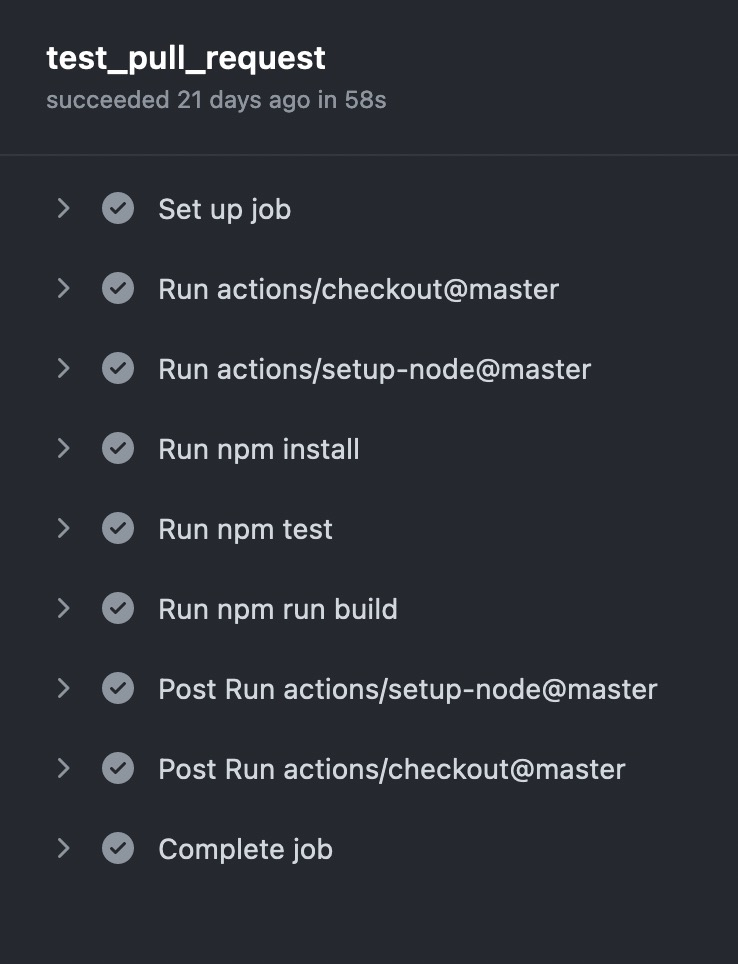
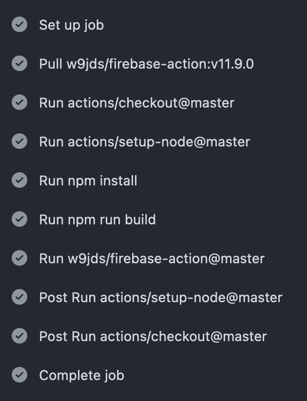
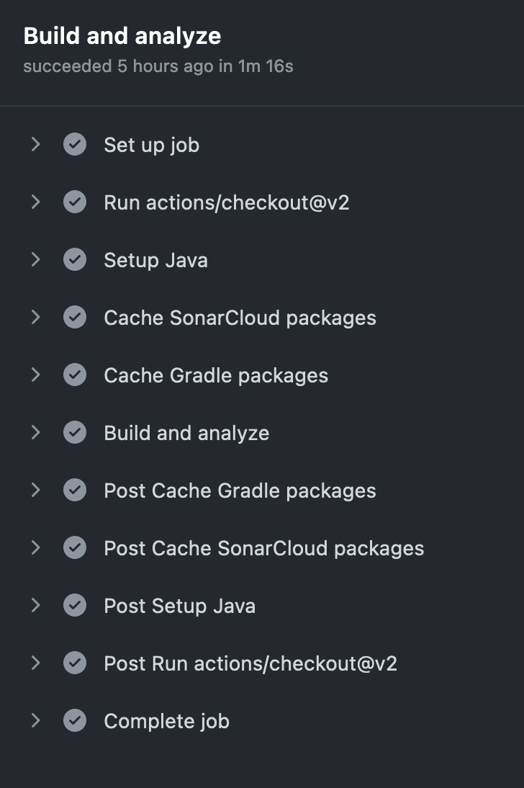
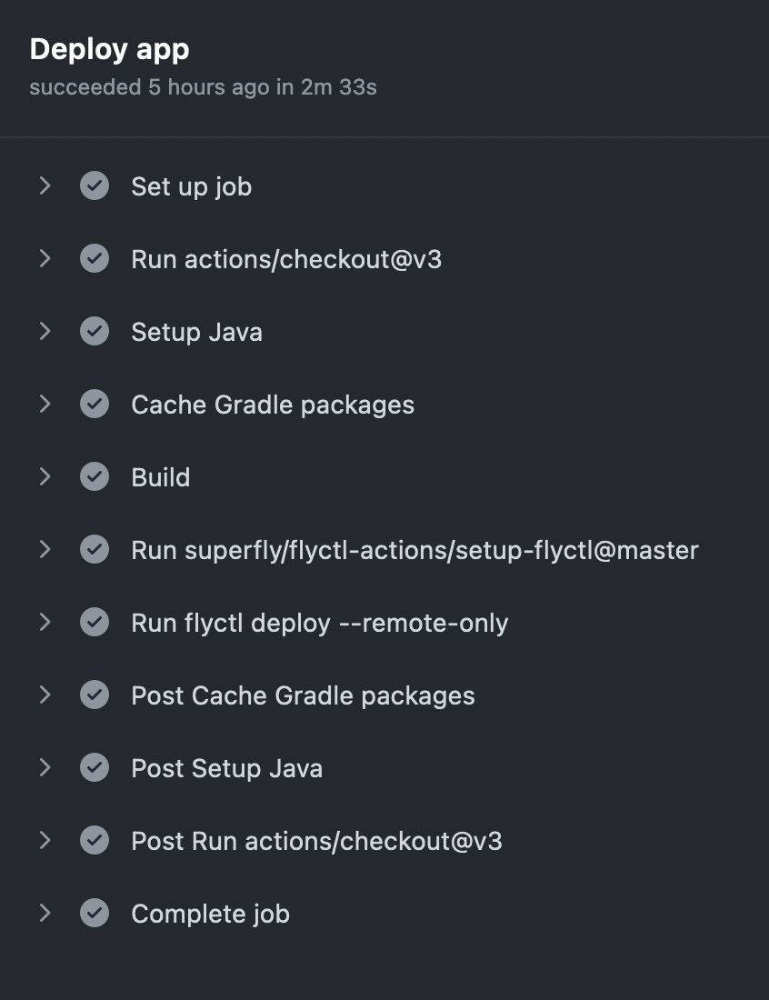

# Continuous Integration and Continius Deployment

## Inhoudsopgave

- [Continuous Integration and Continius Deployment](#continuous-integration-and-continius-deployment)
  - [Inhoudsopgave](#inhoudsopgave)
  - [1. Wat is CI/CD?](#1-wat-is-cicd)
  - [2. Continuous Integration](#2-continuous-integration)
  - [3. Continuous Deployment](#3-continuous-deployment)
  - [4. Github Actions](#4-github-actions)
  - [4. Mijn CI/CD pipeline](#4-mijn-cicd-pipeline)
    - [4.1. Frontend CI](#41-frontend-ci)
    - [4.2. Frontend CD](#42-frontend-cd)
    - [4.3. Backend CI](#43-backend-ci)
    - [4.4. Backend CD](#44-backend-cd)

## 1. Wat is CI/CD?

CI/CD zorgt ervoor dat je het testen en deployen van je software automatisch kan doen. Dit is super handig. Je kunt dit doen door middel van een CI/CD pipeline.

Voor mijn project heb ik gebruik gemaakt van Github Actions. Via hier heb ik alle verschillende stappen van mijn CI/CD pipeline gemaakt. Hieronder zie je een voorbeeld van mijn CI/CD pipeline.

Dit is ook erg belangrijk voor de klant omdat zij hierdoor makkelijk updates kunnen doen en de software altijd up to date is.


## 2. Continuous Integration

Continuous Integration is het automatisch testen van je software. In een CI pipline zet je alle stappen die je wilt uitvoeren. Dit kan bijvoorbeeld zijn het uitvoeren van een test, het bouwen van een docker image of allerlei andere stappen. Dit is erg handig omdat je dan niet handmatig alles hoeft te doen. Stel je voor dat je altijd alles moet testen. Dit is erg tijdrovend en foutgevoelig.

Voor mijn project heb ik gebruik gemaakt van Github Actions. Hier heb ik een CI/CD pipeline gemaakt. Hierin heb ik de volgende stappen:

Ik heb CI/CD voor zowel mijn front- als backend gedaan. Dit heb ik gedaan door middel van Github Actions. Hieronder zie je een voorbeeld van mijn CI/CD pipeline.


_CI/CD zorgt ervoor dat je alle problemen meteen tegenkomt._

## 3. Continuous Deployment

Continuous Deployment is het automatisch deployen van je software. Als ik nu een nieuwe release naar github push en hij wordt goedgekeurd door de CI dan wordt deze automatisch gedeployed. Dit is erg handig omdat je dan niet handmatig alles hoeft te doen.

## 4. Github Actions

Voor mijn project heb ik gebruik gemaakt van Github Actions. Github Actions is een tool die je kan gebruiken om automatisch dingen te doen. De reden waarom github actions zo handig is is omdat je het kan koppelen aan je github repository. Aangezien ik mijn repository al op github had staan was dit erg handig. Daarnaast is het volledig gratis en kan je het voor zowel open source als private repositories gebruiken. Ook is er super veel info en documentatie over te vinden.

In github actions maak je gebruik van yaml files. Dit zijn files die je kan gebruiken om dingen te configureren. In deze files kan je bijvoorbeeld aangeven welke stappen je wilt uitvoeren. Ook kan je aangeven wanneer je deze stappen wilt uitvoeren. Dit kan bijvoorbeeld zijn wanneer je een nieuwe release maakt of wanneer je een pull request maakt.

Hieronder zie je een voorbeeld van een yaml file die ik heb gebruikt voor mijn CI/CD pipeline.

```yaml
name: Quarkus Continues Integration
on:
  push:
    branches:
      - main
  pull_request:
    types: [opened, synchronize, reopened]
jobs:
  build:
    name: Build and analyze
    runs-on: ubuntu-latest
    steps:
      - uses: actions/checkout@v2
        with:
          fetch-depth: 0
      - name: Setup Java
        uses: actions/setup-java@v3
        with:
          distribution: "temurin"
          java-version: "18"
      - name: Cache SonarCloud packages
        uses: actions/cache@v1
        with:
          path: ~/.sonar/cache
          key: ${{ runner.os }}-sonar
          restore-keys: ${{ runner.os }}-sonar
      - name: Cache Gradle packages
        uses: actions/cache@v1
        with:
          path: ~/.gradle/caches
          key: ${{ runner.os }}-gradle-${{ hashFiles('**/*.gradle') }}
          restore-keys: ${{ runner.os }}-gradle
      - name: Build and analyze
        env:
          GITHUB_TOKEN: ${{ secrets.GITHUB_TOKEN }}
          SONAR_TOKEN: ${{ secrets.SONAR_TOKEN }}
        run: ./gradlew build sonarqube --info
```

## 4. Mijn CI/CD pipeline

Hieronder zie je een voorbeeld van mijn CI/CD pipeline.

### 4.1. Frontend CI

Dit zijn de stappen van mijn frontend CI.

- Ophalen van de repository
- Setup van Node
- Node modules installeren
- Testen van de frontend
- Builden van de frontend
- Het opschoon van de CI/CD server



_[Hier het volledige yml bestand van de Frontend CI](./FrontendDeploy.yml)_

### 4.2. Frontend CD

Dit zijn de stappen van mijn frontend CD.

- Ophalen van de firebase github action
- Ophalen van de repository
- Setup van Node
- Node modules installeren
- Builden van de frontend
- Het deployen van de frontend naar firebase
- Het opschoon van de CI/CD server



_[Hier het volledige yml bestand van de Frontend CD](./FrontendDeploy.yml)_

### 4.3. Backend CI

Dit zijn de stappen van mijn backend CI.

- Ophalen van de repository
- Setup van Java
- Builden van de backend
- Testen van de backend
- Builden van de docker image
- De code checken met static code analisys
- De code checken met SonarCloud



_[Hier het volledige yml bestand van de Backend CI](./BackendIntegrade.yml)_

### 4.4. Backend CD

Dit zijn de stappen van mijn backend CD.

- Ophalen van de fly.io github action
- Ophalen van de repository
- Setup van Java
- Builden van de backend
- Docker container maken
- Het deployen van de backend naar fly.io
- Het opschoon van de CI/CD server



_[Hier het volledige yml bestand van de Backend CD](./BackendDeploy.yml)_
