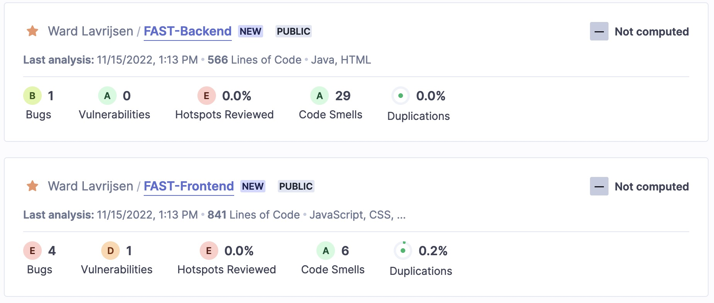
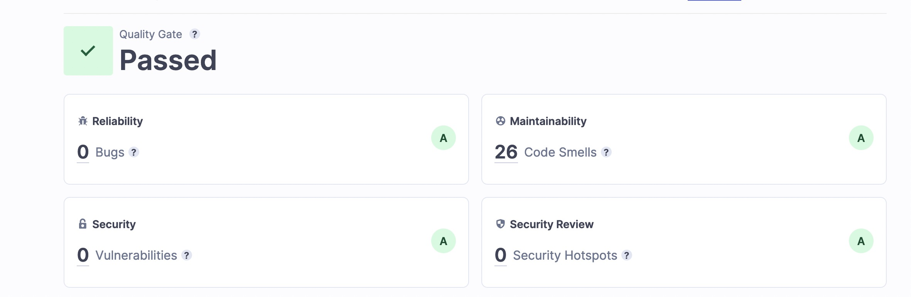
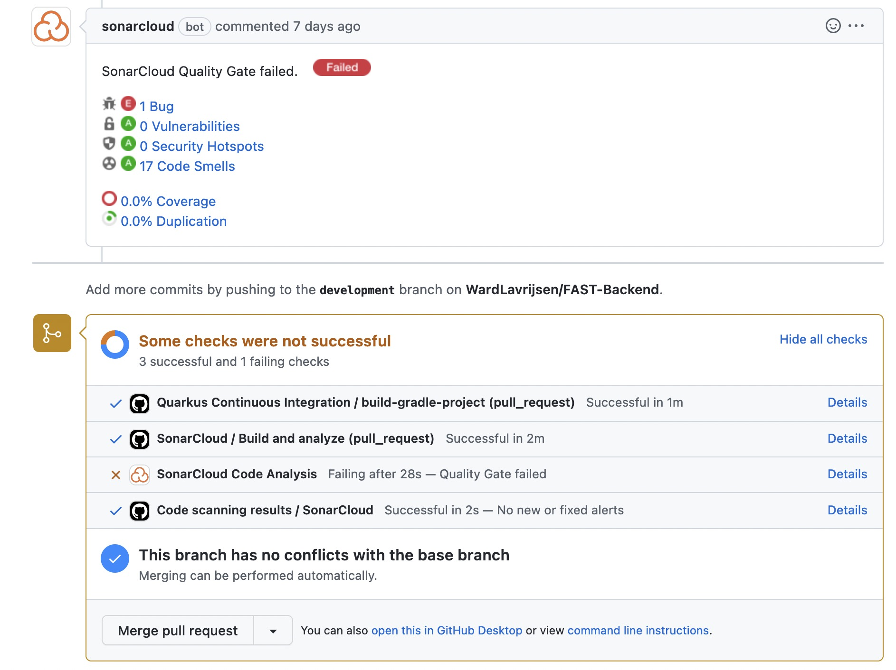
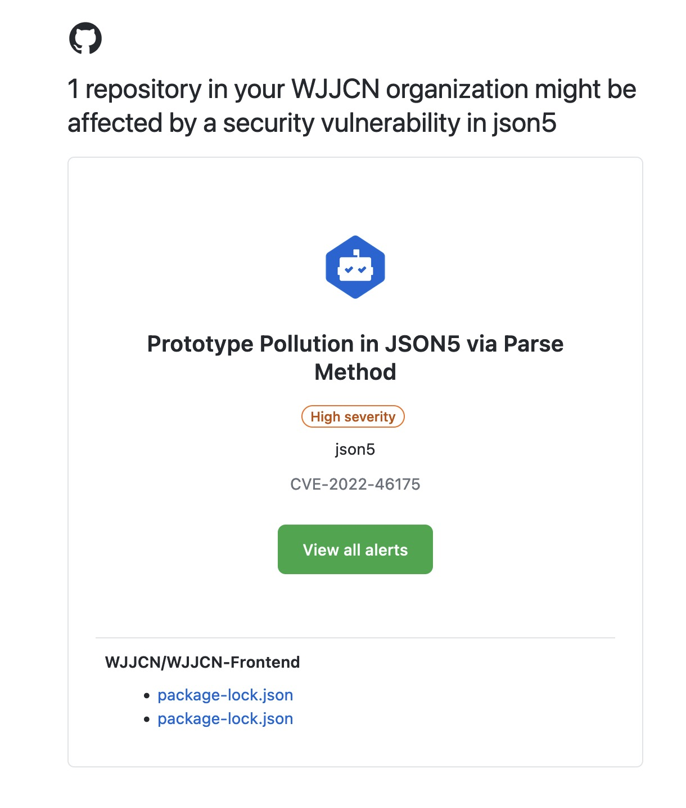
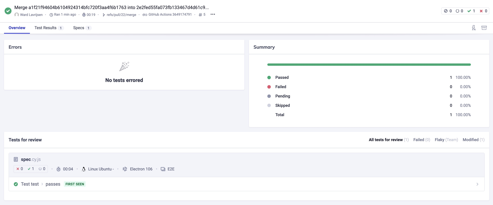
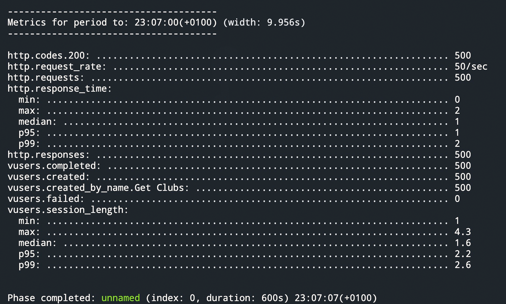
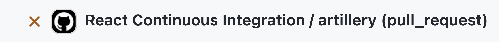
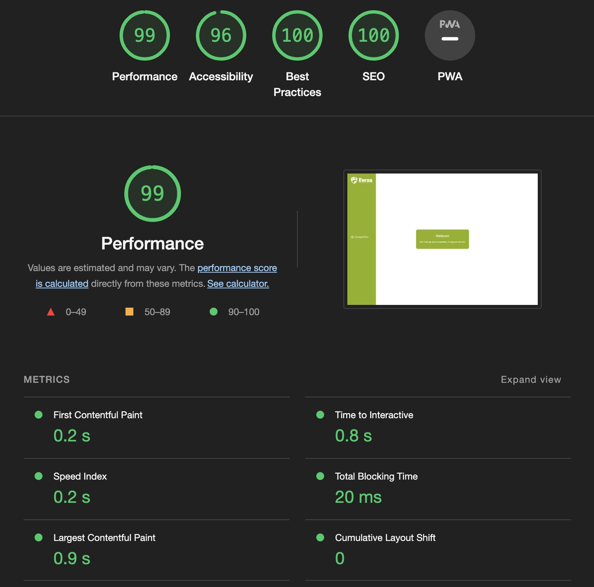

# Software Quality Assurance

## Inhoudsopgave

- [Software Quality Assurance](#software-quality-assurance)
  - [Inhoudsopgave](#inhoudsopgave)
  - [1. Wat is Software Quality Assurance?](#1-wat-is-software-quality-assurance)
  - [2 Automatiseren](#2-automatiseren)
    - [2.1 CI/CD](#21-cicd)
  - [3. Unit Testing](#3-unit-testing)
  - [4. Unit Testen externe API](#4-unit-testen-externe-api)
  - [4. Integration Testing](#4-integration-testing)
  - [4. Static code analysis](#4-static-code-analysis)
    - [4.1 Github Static Code Analysis](#41-github-static-code-analysis)
  - [5. End-to-end testen](#5-end-to-end-testen)
    - [5.2 Cypress](#52-cypress)
  - [6. Load / Stress testen](#6-load--stress-testen)
    - [6.1 Load testen in CI/CD](#61-load-testen-in-cicd)
  - [7. Performance testen](#7-performance-testen)
  - [8. Conclusie](#8-conclusie)

## 1. Wat is Software Quality Assurance?

Sofware Quality Assurance is een van de belangrijkste dingen in de ontwikkeling van je software. De reden hiervoor is dat je wil dat je software goed werkt en dat je software niet kapot gaat. Stel je voor dat je een nieuwe versie released en alles breekt. Om dit te voorkomen zijn er allerlei manieren om goede software quality Assurance te hebben.

We maken software voor anderen. Hoogst waarschijnlijk degene die ervoor betalen. Zij verwachten natuurlijk dat je software van hoge kwaliteit is en zij er op kunnen bouwen. Door middel van quality Assurance kun je ervoor zorgen dat je software van hoge kwaliteit is en dat je software niet kapot gaat.


## 2 Automatiseren

Als je constant al deze verschillende testen zou moeten doen ben je voor eeuwig bezig. Daarom is het super handig om dit te automatiseren. Je kunt dit doen door middel van een CI/CD pipeline.

### 2.1 CI/CD

CI/CD staat voor Continuous Integration en Continuous Deployment. Doormiddel van de CI/CD kunnen alle vormen van QA worden toegepast in mijn code en het allerbelangrijkste is dat door de CI/CD dit allemaal automatisch wordt getest.

Meer lezen over mijn CI/C

[Naar Bestand](../README.md#46-cicd)

## 3. Unit Testing

Unit Testing is het testen van een klein stukje code. Dit kan een functie zijn of een stukje code. Dit is de meest bekende vorm van QA.

Doordat ik in dit project gebruik maak van veelal bestaande libraries is het niet mijn voorkeur om unit testing toe te passen. Dit omdat ik niet veel eigen logic code heb. Het zou dus een stuk verstandiger zijn om integration testing toe te passen.

## 4. Unit Testen externe API

Ik zeg nu net dat ik geen unit testen doe maar ik heb wel een unit test gemaakt voor de externe API. Dit omdat ik hier zelf de code voor heb geschreven en ik dus wel kan testen of de code die ik heb geschreven werkt.

De belangrijkste reden is dat mijn externe API een externe API is. Dit betekent dat ik niet kan testen of de API werkt. Ik kan alleen testen of mijn code die de API aanroept werkt.

Om dit te testen heb ik gebruik gemaakt van een test repository en een interface. Hierdoor kan ik in mijn test repository een mock maken van de externe API. Hierdoor kan ik testen of mijn code die de externe API aanroept werkt.

```java
@Test
    void addGames() {
        List<Game> beforeGames = gameService.allGames();
        gameService.addGames("1", "3");
        List<Game> afterGames = gameService.allGames();
    }
```

_Ik kan dan de testen makkelijk op deze manier maken_

## 4. Integration Testing

Integration Testing is het testen van een stukje code in combinatie met andere stukken code. Dit is een stuk minder bekend dan unit testing. Dit is ook de reden dat ik dit heb gekozen voor mijn project.

Voor de integration testen heb ik een h2 (in memory) database opgezet en heb ik een aantal testen geschreven. Deze testen testen de verschillende endpoints van mijn API. Dit doe ik door middel van een libary in quarkus. Deze test client stuurt een request naar de API en kijkt of de response goed is.

Voorbeeld van een integration test in java:

```java
@QuarkusTest
public class GameRecourceTest {
    @Test
    public void getGamesAjax() {
        given()
                .when().get("/api/game/88/194")
                .then()
                .statusCode(200)
                .body("size()", is(2));
    }
}

```

[Frontend repo](https://github.com/WardLavrijsen/FAST-Frontend.git) | [Backend repo](https://github.com/WardLavrijsen/FAST-Backend)

## 4. Static code analysis

Een andere manier om de kwaliteit van je code te testen is door middel van static code analysis. Dit is het analyseren van je code zonder dat je code wordt uitgevoerd. Ik heb dit gedaan door middel van sonarcloud te intergreren in mijn CI/CD pipeline. Hierdoor kan ik mijn code analyseren en verbeteren.


_De eerste keer dat sonarcloud de static code analysis uitvoerde_


_Nadat ik de problemen had opgelost die in sonarcloud naar voren waren gekomen_

Zo zorgt deze static code analysis ervoor dat ik mijn code kan verbeteren.

Het grootste voordeel hieraan is dat op het moment dat ik de code push naar github, de CI/CD pipeline automatisch wordt uitgevoerd. Hieruit volgt een overzicht van de kwaliteit van mijn code. Hieruit krijg ik dus een duidelijk overzicht van wat ik moet verbeteren.


_Hier is te zien wat er bij deze CI fout ging._

### 4.1 Github Static Code Analysis

1x per week voert github een static code analysis uit en hier krijg ik dan een mail van als er een fout is met een pakkage. Zo ziet die mail er dan uit



## 5. End-to-end testen

End-to-end tests zijn een vorm van softwaretests waarbij de volledige applicatie wordt getest. Deze vorm van testen is bedoeld om de prestaties van een applicatie van begin tot eind te evalueren.

Een van de belangrijkste voordelen van end-to-end testen is dat het kan helpen bij het identificeren van problemen die misschien niet onmiddellijk opvallen bij het testen van individuele componenten of subcomponenten van een applicatie. Een unit test kan bijvoorbeeld alleen een specifieke functie of module van een applicatie testen, terwijl een integratietest alleen test hoe verschillende componenten op elkaar inwerken.

Een ander voordeel van end-to-end testen is dat het kan helpen problemen op te sporen die het gevolg zijn van wijzigingen die tijdens het ontwikkelingsproces in de applicatie zijn aangebracht. Het is belangrijk om regelmatig het hele systeem te testen om ervoor te zorgen dat deze wijzigingen geen nieuwe bugs of problemen introduceren. Door end-to-end tests uit te voeren, kunnen ontwikkelaars eventuele problemen opvangen die door wijzigingen in de applicatie zijn geïntroduceerd en stappen ondernemen om deze op te lossen voordat de applicatie wordt vrijgegeven.

### 5.2 Cypress

Cypress is een op JavaScript gebaseerd end-to-end framework. Het is ontworpen om het ontwikkelaars gemakkelijk te maken tests voor hun toepassingen te maken en uit te voeren. Het biedt een gebruiksvriendelijke interface voor het uitvoeren en debuggen van tests. Cypress een populaire keuze voor end-to-end testen, vanwege het gebruiksgemak en de krachtige functies.

Ik heb mijn end-to-end testen gemaakt met Cypress.
Dit is een hele simpele voorbeeldtest met Cypress in react.

```javascript
describe("Is LaLiga available", () => {
  it("passes", () => {
    cy.visit("http://localhost:3000");
    cy.contains("La Liga").click();
  });
});
```

Daarnaast heb ik het toegevoegd aan mijn github action om de testen automatisch te laten uitvoeren.

```yaml
cypress-run:
  runs-on: ubuntu-latest
  steps:
    - name: Checkout
      uses: actions/checkout@v2
    # Install NPM dependencies, cache them correctly
    # and run all Cypress tests
    - name: Cypress run
      uses: cypress-io/github-action@v4 # use the explicit version number
      with:
        build: npm run build
        start: npm start
        record: true
      env:
        CYPRESS_RECORD_KEY: ${{secrets.CYPRESS_CLOUD}}
        GITHUB_TOKEN: ${{secrets.GITHUB_TOKEN}}
```

Ook maak ik gebruik van een hele handige tool genaamd cypress cloud. Dit is een extra stap in het CI/CD process maar zorgt ervoor dat naast alle sonarcloud data ook de cypress testdata naar de cloud wordt gestuurd zodat je het makkelijk kan zien.


_Hier is te zien wat Cypress bijhoudt._

## 6. Load / Stress testen

Voor de load / stress testen (eigenlijk hetzelfde) heb ik gebruik gemaakt van artillery. Dit is een command line tool waarmee ik mijn applicatie kan testen onder een bepaalde load. Dus een hele hoop requesten tegelijk.

Hier is te zien hoe een script van artillery eruit ziet

```yaml
config:
  target: "http://127.0.0.1:3000/"
  phases:
    - duration: 600
      arrivalRate: 50
    - duration: 60
      arrivalRate: 5
      name: Warm up
    - duration: 120
      arrivalRate: 5
      rampTo: 50
      name: Ramp up load
    - duration: 600
      arrivalRate: 50
      name: Sustained load
  ensure:
    maxErrorRate: 1
    max: 500

scenarios:
  - name: "Get Clubs"
    flow:
      - get:
          url: "/"
```

Door dit te doen krijg ik inzicht in mijn applicatie en wat het wel en niet kan handlen. Dit is een hele handige tool om te gebruiken.

Zo komt de data eruit en is te zien dat het allemaal goed verloopt onder load / stress



### 6.1 Load testen in CI/CD


Zoals je hier kan zien werkt artillery niet met CI/CD. Wat is hier de reden voor. Omdat de loadtest 30 minuten duurt en best wel CPU intens is wordt dit niet ondersteund door de gratis versie van github actions.

## 7. Performance testen

Een hele handige manier om performance testen uit te voeren is met de in browser gebouwde tool genaamd lighthouse. Dit is dan ook waar ik gebuik van heb gemaakt.

Ik heb een script die in de frontend runt.

```js
const lighthouse = require("lighthouse");
const chromeLauncher = require("chrome-launcher");
const fs = require("fs");

(async () => {
  const chrome = await chromeLauncher.launch({ chromeFlags: ["--headless"] });
  const options = {
    logLevel: "info",
    output: "html",
    // onlyCategories: ["performance"],
    port: chrome.port,
  };
  const runnerResult = await lighthouse("http://localhost:3000", options);

  console.log("Report is done for", runnerResult.lhr.finalUrl);

  const performanceScore = runnerResult.lhr.categories.performance.score * 100;
  console.log("Performance score was", performanceScore);

  const reportHtml = runnerResult.report;
  fs.writeFileSync("lhreport.html", reportHtml);

  await chrome.kill();
})();
```

Hieruit volgt dan een score



[Link naar lighthouse report](../images/lighthouseScore.pdf)

## 8. Conclusie

Door alle deze testen te doen ben ik erachter gekomen hoe belangrijk het eigenlijk wel niet is om je code te testen. Nooit eerder in mijn projecten heb ik hier bij stil gestaan maar nu denk ik er veel anders over.

Zo heb ik verschillende soorten Quality Assurance toegevoegd:

- Unit testen
- Integration testen
- end-to-end testen
- load / stress testen
- performance testen
- static code analysis

Door dit allemaal toe te passen heb ik allerlei verschillende manier en vormen van testen geleerd en hoe ik deze kan integreren in mijn applicatie.
