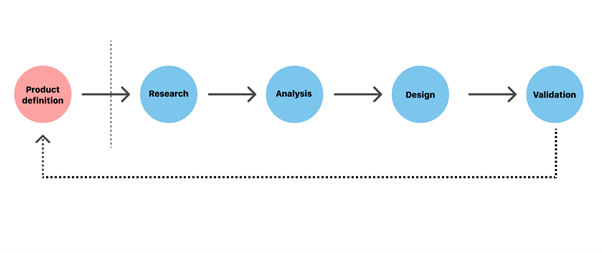
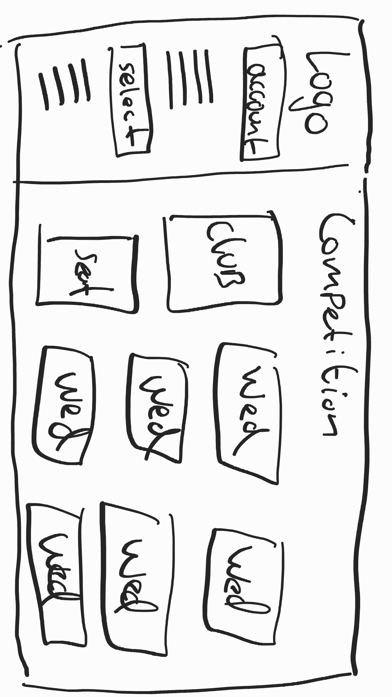
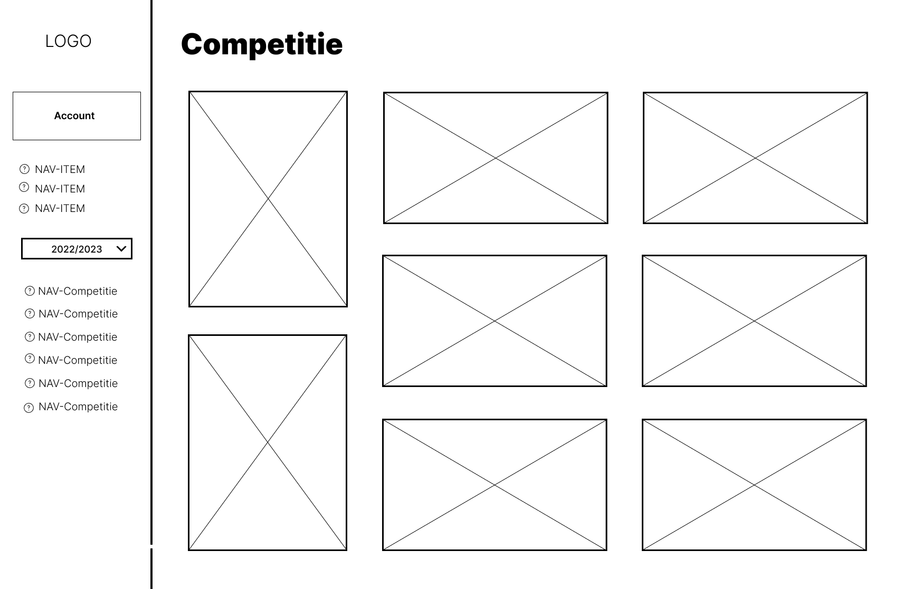
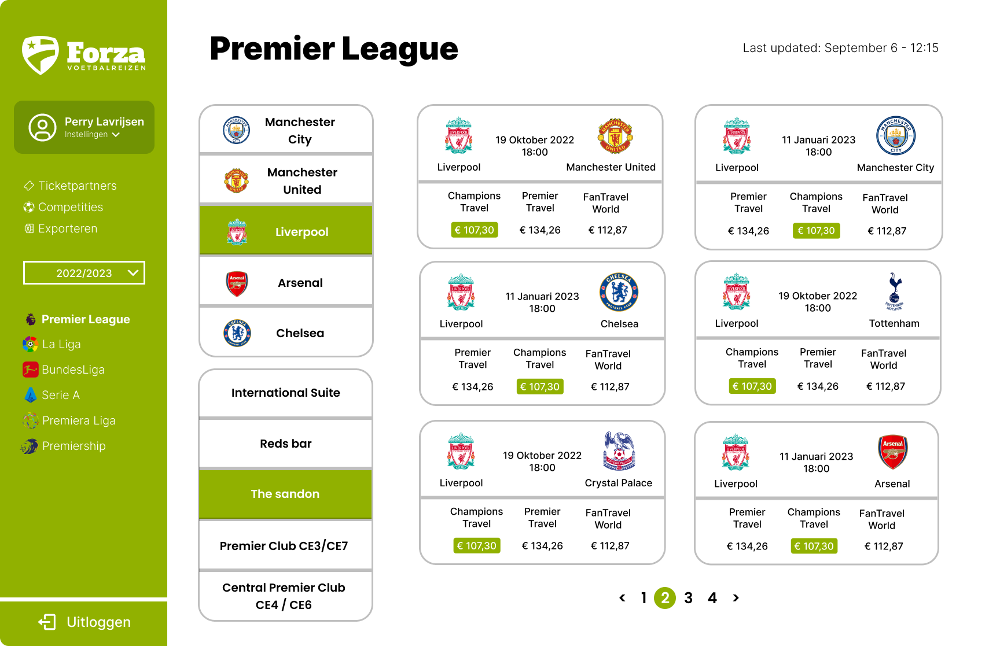

# FAST UX

[bron](https://xd.adobe.com/ideas/guides/ux-design-process-steps/)

## Inhoudsopgave

- [FAST UX](#fast-ux)
  - [Inhoudsopgave](#inhoudsopgave)
  - [Hoe gaat het UX-proces te werk?](#hoe-gaat-het-ux-proces-te-werk)
  - [Product definition](#product-definition)
    - [Het product](#het-product)
  - [Research](#research)
    - [User survey](#user-survey)
    - [Interview Stakeholder](#interview-stakeholder)
  - [Analyse](#analyse)
  - [Design](#design)
    - [Sketch](#sketch)
    - [Wireframe](#wireframe)
    - [Prototype](#prototype)
  - [Validation](#validation)

## Hoe gaat het UX-proces te werk?

De 5 stappen van UX zijn:

- Product definition
- Research
- Analysis
- Design
- Validation

## Product definition

Wat superbelangrijk is bij het maken van het product is het product begrijpen. Voor wie is het? Waarom bestaat het? Wie zijn de gebruikers? Wat is de belangrijkste informatie voor de gebruiker? Dit wordt vaak door het team in samenwerking met de stakeholders besproken.

### Het product

FAST is een platform voor Forza voetbal reizen om een duidelijk overzicht te krijgen in welke wedstrijden ze aanbieden en de prijzen voor deze wedstrijden bij de verschillende ticketpartners. Het is dus erg belangrijk dat de ui makkelijk en logisch in elkaar zit dat het voor de gebruikers makkelijk is om de info te vinden.

## Research

Een belangrijk onderdeel is research. Dit is het onderzoeken van wensen van klanten.

### User survey

De user survey is afgenomen bij mijn vader. De gebruiker van FAST. De survey is afgenomen op 17-10-2022. De survey is afgenomen via een gesprek. De survey bestaat uit 5 vragen. De vragen zijn:

---

**Vraag:**
Wat wil je bereiken met dit product?

**Antwoorden:**

- Ervoor zorgen dat de wedstrijden makkelijk geselecteerd kunnen worden en hier geen handmatig werk voor nodig is.
- De prijzen zien van de verschillende ticketpartners om een vergelijking te kunnen maken
- Klanten makkelijk kunnen helpen met het kunnen bieden van de juiste prijzen op elk moment

---

**Vraag:**
Wat zijn de hindernissen die je zonder dit product tegenkomt?

**Antwoorden:**

- De prijzen op de website die niet kloppen of erg oud zijn.
- Het kost enorm veel tijd om alle wedstrijden handmatig in het systeem te zetten.

---

**Vraag:**
Heb je verder nog ideeën voor dit product?

**Antwoorden:**

- Moderne uitstraling met een overzichtelijk ui

---

**Vraag:**
Waar wil je snel een overzicht van kunnen zien?

**Antwoorden:**

- De prijzen van een bepaalde wedstrijd.

---

**Vraag:**
Hoe nuttig is het product voor jou?

**Antwoorden:**

- Voor ons zou het enorm veel extra tijd op leveren en een heel stuk efficiëntie

---

### Interview Stakeholder

Ook is het natuurlijk van belang om te weten wat de stakeholder wil. Daarvoor zijn deze vragen opgesteld.

**Vragen:**

1. Wat is het probleem jullie proberen op te lossen?
2. Wat moet het product doen?
3. Wie zijn de gebruikers van dit product?
4. Zijn er al stijleisen waaraan voldaan moet worden?
5. Wat weet je zeker van de gebruikers?

**Antwoorden:**

1. Het binnenhalen van ticketprijzen zodat onze consumenten het goedkopste uit zijn.
2. Prijzen van verschillende ticketpartners vergelijken voor de gekozen wedstrijden.
3. Het personeel van Forza Voetbalreizen.
4. De kleuren van Forza
5. Die willen snel een overzicht hebben.

## Analyse

## Design

Als de requirements bekend zijn en iedereen weet wat het product moet gaan doen kan er worden begonnen met het maken van een design. Dit gaat in verschillende stappen. Het begint met een sketch, dan ga je een wireframe maken en daarna een prototype.

### Sketch

De sketch is een schets van hoe het product eruit moet gaan zien.

### Wireframe

De wireframe is een schets van hoe het product eruit moet gaan zien. Dit is een schets van de pagina's en de navigatie. Dit is alleen een stuk beter doordacht design dan de snelle eerste schets.

### Prototype

Het Prototype is een werkend product. Dit is een werkend product waarin je kunt navigeren en waarin je kunt zien hoe het product eruit gaat zien.

[Figma design file](https://www.figma.com/file/6gLzOPT0u7KQ3BVjiADe6N/FAST?node-id=0%3A1)

## Validation
