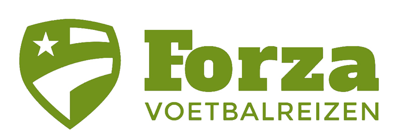
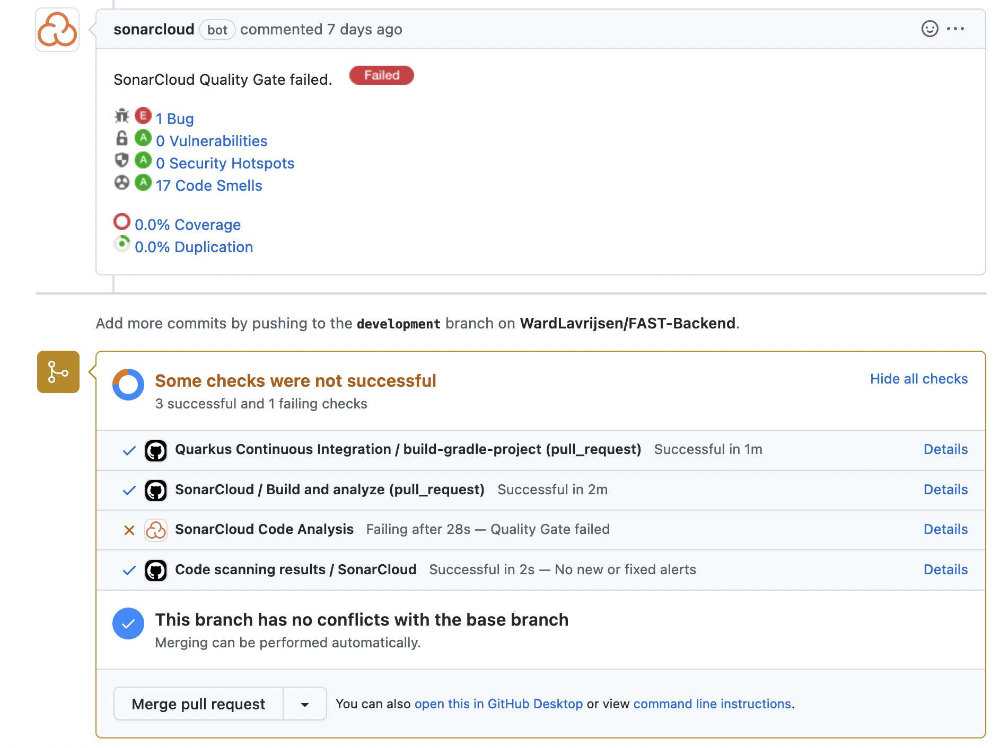

# Leeswijzer voor semster 3 portfolio

Geschreven door: Ward Lavrijsen  
Voor: S-DB-IPS3 and S-DB-GPS3  
Klas: S3-DB03  
Leraren: Marc van Grootel en Marc van Heumen

## Inhoudsopgave

- [Leeswijzer voor semster 3 portfolio](#leeswijzer-voor-semster-3-portfolio)
  - [Inhoudsopgave](#inhoudsopgave)
  - [1. Inleiding](#1-inleiding)
  - [2. Leeruitkomsten](#2-leeruitkomsten)
    - [2.1 You design and build user-friendly, full-stack web applications.](#21-you-design-and-build-user-friendly-full-stack-web-applications)
    - [2.2 You use software tooling and methodology that continuously monitors and improve the software quality during software development.](#22-you-use-software-tooling-and-methodology-that-continuously-monitors-and-improve-the-software-quality-during-software-development)
    - [2.3 You choose and implement the most suitable agile software development method for your software project.](#23-you-choose-and-implement-the-most-suitable-agile-software-development-method-for-your-software-project)
    - [2.4 You design and implement a (semi)automated software release process that matches the needs of the project context.](#24-you-design-and-implement-a-semiautomated-software-release-process-that-matches-the-needs-of-the-project-context)
    - [2.5 You recognize and take into account cultural differences between project stakeholders and ethical aspects in software development.](#25-you-recognize-and-take-into-account-cultural-differences-between-project-stakeholders-and-ethical-aspects-in-software-development)
    - [2.6 You analyze (non-functional) requirements, elaborate (architectural) designs and validate them using multiple types of test techniques.](#26-you-analyze-non-functional-requirements-elaborate-architectural-designs-and-validate-them-using-multiple-types-of-test-techniques)
    - [2.7 You analyze and describe simple business processes that are related to your project.](#27-you-analyze-and-describe-simple-business-processes-that-are-related-to-your-project)
    - [2.8 You act in a professional manner during software development and learning.](#28-you-act-in-a-professional-manner-during-software-development-and-learning)
  - [3 Onderzoek](#3-onderzoek)
    - [3.1 Dot Framework Security](#31-dot-framework-security)
    - [3.2 Agile](#32-agile)
    - [3.3 Dot Framework](#33-dot-framework)
    - [3.4 Business processes](#34-business-processes)
  - [4 Indiviudueel project](#4-indiviudueel-project)
    - [4.1 Projectomscrijving](#41-projectomscrijving)
    - [4.2 Waarom dit project:](#42-waarom-dit-project)
    - [4.3 Agile](#43-agile)
    - [4.4 UI/UX](#44-uiux)
    - [4.5 Software Quality Assurance](#45-software-quality-assurance)
    - [4.6 Software design](#46-software-design)
    - [4.7 CI/CD](#47-cicd)
    - [4.8 Profesionele bijdrage](#48-profesionele-bijdrage)
  - [5 Groepsproject](#5-groepsproject)
    - [5.1 Wie zijn World of Content](#51-wie-zijn-world-of-content)
    - [5.2 Waarom dit project:](#52-waarom-dit-project)
    - [5.3 Software keuze](#53-software-keuze)
    - [5.3 Agile](#53-agile)
    - [5.4 UI/UX](#54-uiux)
    - [5.5 Mijn bijdrage](#55-mijn-bijdrage)
    - [5.6 Profesionele bijdrage](#56-profesionele-bijdrage)
  - [6 Reflectie](#6-reflectie)
    - [6.1 Wat heb ik geleerd?](#61-wat-heb-ik-geleerd)
    - [6.2 Wat kan ik beter doen?](#62-wat-kan-ik-beter-doen)
    - [6.3 Voortgang](#63-voortgang)

## 1. Inleiding

Dit is de leeswijzer voor mijn portfolio van semester 3 ICT aan de fontys. In deze leeswijzer kun je zien wat ik heb gemaakt. Zowel indivueel als in groepsverband. Ook kun je zien wat ik heb geleerd en hoe dit is verwerkt met mijn leeruitkomsten. Bij ieder onderdeel staan de links naar de verschillende onderdelen en de documentatie daarvan. Ook staat er een korte beschrijving van het onderdeel.

In dit document vind u de volgende onderdelen: De verschillende leeruitkomsten en hoe deze zijn toegepast, het research onderdeel van het project, mijn individuele project, het groepsproject. En de reflectie op mijn leeruitkomsten.

## 2. Leeruitkomsten

In dit onderdeel zijn alle leeruitkomsten en uitleg te vinden. Ook wordt hierin gelinkt naar de verschillende onderdelen waarin deze leeruitkomsten zijn toegepast.

### 2.1 You design and build user-friendly, full-stack web applications.

**User friendly:**
You apply basic User experience testing and development techniques.

- [UI/UX Indiviudueel](#44-uiux)
- [UI/UX Groepsproject](#54-uiux)

**Full-stack:**
You design and build a full stack application using commonly accepted front end (Javascript-based framework) and back end techniques (e.g. Object Relational Mapping) choosing and implementing relevant communication protocols and addressing asynchronous communication issues.

- [Individueel Project](#4-indiviudueel-project)
- [Groeps Project](#5-groepsproject)

### 2.2 You use software tooling and methodology that continuously monitors and improve the software quality during software development.

**Tooling and methodology:**
Carry out, monitor and report on unit integration, regression and system tests, with attention for security and performance aspects, as well as applying static code analysis and code reviews.

- [Software Quality Assurance](#45-software-quality-assurance)

### 2.3 You choose and implement the most suitable agile software development method for your software project.

**Choose:**
You are aware of the most popular agile methods and their underlying agile principles. Your choice of a method is motivated and based on well-defined selection criteria and context analyses.

- [Agile research and workshop](#32-agile)
- [Agile individueel project](#43-agile)

### 2.4 You design and implement a (semi)automated software release process that matches the needs of the project context.

**Design and implement:**
You design a release process and implement a continuous integration and deployment solution (using e.g. Gitlab CI and Docker).

- [CI/CD Individueel project](#46-cicd)

### 2.5 You recognize and take into account cultural differences between project stakeholders and ethical aspects in software development.

**Recognize:**
Recognition is based on theoretically substantiated awareness of cultural differences and ethical aspects in software engineering.

- [Link](#project-1)

**Take into account:**
Adapt your communication, working, and behavior styles to reflect project stakeholders from different cultures; Address one of the standard Programming Ethical Guidelines (e.g., ACM Code of Ethics and Professional Conduct) in your work.

- [Link](#project-1)

### 2.6 You analyze (non-functional) requirements, elaborate (architectural) designs and validate them using multiple types of test techniques.

**Multiple types of test techniques:**
You apply user acceptance testing and stakeholder feedback to validate the quality of the requirements. You evaluate the quality of the design (e.g., by testing or prototyping) taking into account the formulated quality properties like security and performance.

- [Software Design individueel](#45-software-design)
- [Software Quality Assurance](#45-software-quality-assurance)
- [Professionele wijze individueel](#47-profesionele-bijdrage)
- [Professionele wijze groep](#56-profesionele-bijdrage)

### 2.7 You analyze and describe simple business processes that are related to your project.

**Simple:**
Involving stakeholders, predominantly sequential processes with one or two alternative paths.

- [Software Design Individueel](#45-software-design)
- [Business Processes](#34-business-processes)

### 2.8 You act in a professional manner during software development and learning.

**Professional manner:**
You actively ask and apply feedback from stakeholders and advise them on the most optimal technical and design (architectural) solutions. You choose and substantiate solutions for a given problem.

- [Professionele wijze individueel](#47-profesionele-bijdrage)
- [Professionele wijze groep](#56-profesionele-bijdrage)

## 3 Onderzoek

### 3.1 Dot Framework Security

### 3.2 Agile

Agile is een heel belangrijk concept in de software engineering. Dit is ook in het gehele semester toegepast om makkelijker, sneller en overzichtelijker te werken. Om te weten wat agile precies inhoud en wat de verschillende frameworks op agile zijn heb ik hier een onderzoekje naar gedaan. In dit semester heb ik voornamelijk scrum gebruikt maar in het onderzoek staat ook nog andere framworks.

[Naar bestand](Research/Agile.md)

### 3.3 Dot Framework

### 3.4 Business processes

Hierin heb ik business processes onderzocht en hoe deze in de software engineering worden toegepast. Ook heb ik een voorbeeld van een business process gemaakt.

Daarnaast heb ik hier mijn eigen business process uitgewerkt. Dit is het business process van mijn individuele project.

[Naar bestand](Research/BusinessProcess.md)

## 4 Indiviudueel project

### 4.1 Projectomscrijving

Het Forza Automation System for Tickets kort gezegd FAST wordt gevoed door een website waarop aangegeven kan worden welke wedstijden, clubs en competities in het systeem moeten komen. Daarna wordt er dagelijks van de externe ticketpartners alle data opgehaald die bij tickets komen kijken. Dit allemaal in een database opgeslagen zodat het makkelijk is om alle recente ticketprijzen te kunnen zien. Deze info is dan allemaal terug te zien op deze website maar is ook te koppelen door middel van een API aan de al bestaande website.

### 4.2 Waarom dit project:

Dit project is opgezet voor Forza Voetbalreizen. Het probleem binnen dit bedrijf is dat alle prijzen, wedstrijden en tickets handmatig ingevoerd moeten worden, dit wordt daarna opgeslagen in een super complex Excel bestand. Dit is super foutgevoelig en kost erg veel tijd. Eerst moet op het begin van elk seizoen alle wedstrijden die ze aanbieden handmatig in het systeem gezet worden. Daarna moeten bij alle ticketpartners om prijzen gevraagd worden en dit moet allemaal in een Excel bestand komen. Doordat dit op het begin van het seizoen gebeurt kan dit betekenen dat de website is gevoed met te lage prijzen, verkeerde beschikbaarheid of andere problemen die komen kijken bij niet geüpdatete prijzen. Dit betekent dus dat er bij iedere wijziging een update moet plaatsvinden. Dit kost super veel tijd. En dat is wat FAST kan oplossen door dit allemaal automatisch te doen.

Omdat ik iets nieuws wou leren in dit project heb ik gekozen om met Quarkus en React te gaan. De keuze voor Quarkus kwam door de workshop die we hierover hadden gehad. Ik wou erg graag Java gaan leren en na deze workshop leek Quarkus mij erg interestant en ben ik dus hier naar gegaan. React heb ik gekozen omdat er erg veel over te vinden is en nogsteeds het meest populair is.

### 4.3 Agile

Voor dit project heb ik gebruik gemaakt van [Agile en scrum](#32-agile). De reden waarom ik voor scrum heb gekozen had voornamelijk met het groepsproject te maken. Omdat wij hier ook gebruik maakte van scrum was dit erg eenvoudig en logisch te implementeren in dit project.

Ik heb gebruik gemaakt van een github project om mijn progress en userstorys bij te houden. Ook heb ik userstory mapping toegepast om mijn userstorys te kunnen visualiseren. Dit heb ik gedaan door middel van figma.

[Userstory mapping](https://www.figma.com/file/UksZOWiov6Hl1ol9EqJDAM/FAST-user-story-mapping?node-id=0%3A1)

[Github Project](https://github.com/users/WardLavrijsen/projects/3)

### 4.4 UI/UX

Om ervoor te zorgen dat de software makkelijk te gebruiken is en het overzichtelijk en duidelijk is heb ik UI/UX toegepast.

[Bekijk bestand](/FAST/UX.md)

_Voorbeeld van de hoofdpagina_

### 4.5 Software Quality Assurance

Hoe belangrijk is het wel niet dat je code altijd werkt en niet dat je op het moment van een nieuwe release ineens een bug tegenkomt. Om dit te voorkomen heb ik gebruik gemaakt van software quality assurance. Dit heb ik gedaan door middel van allerlei verschilllende soorten testen en door middel van static code analysis.

[Bekijk bestand](/FAST/SoftwareQualityInsurence.md)

### 4.6 Software design

Hier zijn alle eisen en wensen van de klant te vinden. Ook is hierin te zien hoe ik deze heb vertaald naar de software. Requirements, De gesprekken met de stakeholder en het C4 model.

[Bekijk bestand](/FAST/SoftwareDesign.md)

### 4.7 CI/CD

Om ervoor te zorgen dat de software makkelijk te deployen is en dat er geen fouten in de software komen heb ik CI/CD toegepast. Dit is ook erg belangrijk voor de klant omdat zij hierdoor makkelijk updates kunnen doen en de software altijd up to date is. Ook is het makkelijker om de software te testen en te deployen. om dit te doen heb ik gebruik gemaakt van Github Actions. Dit is een gratis tool die je kan gebruiken om CI/CD te doen. Ik heb hier een workflow voor gemaakt die elke keer als er een push wordt gedaan naar de master branch de software gaat builden en testen. Als dit succesvol is wordt de software gedeployed naar de server. Ook heb ik een workflow gemaakt die elke keer als er een pull request wordt gedaan de software gaat builden en testen. Als dit succesvol is kan de pull request gemerged worden. Dit is erg handig omdat je dan weet dat de software altijd werkt en dat er geen fouten in de software zitten.

_CI/CD zorgt ervoor dat je alle problemen meteen tegenkomt._

[Frontend CI](/FAST/FrontendIntegrade.yml) | [Frontend CD](/FAST/FrontendDeploy.yml)

[Backend CI](/FAST/BackendIntegrade.yml) | [Backend CD](/FAST/BackendDeploy.yml)

[Frontend repo](https://github.com/WardLavrijsen/FAST-Frontend.git) | [Backend repo](https://github.com/WardLavrijsen/FAST-Backend)

### 4.8 Profesionele bijdrage

Tijdens het project heb ik erg veel samengewerkt met mijn stakeholder. Heel erg vaak bij elkaar gezeten over de voortgang en de verschillende requirements. Dit naast alle feedback die ik heb gekregen van docenten en het verwerken van die feedback geeft mij een goede professionele bijdrage aan dit project.

## 5 Groepsproject

### 5.1 Wie zijn World of Content

World of Content levert aan zijn klanten een platform voor content delivery. zij zorgen ervoor dat jou content op alle platform klopt. Denk hierbij aan Coca-Cola. Zij hebben erg veel verschillende producten en willen dat deze bij al hun retailers overeenkomt. Hier komt World of content aan te pas. WoC zorgt ervoor dat een brand hun content op hun platform kan beheren en uitsturen naar alle verschillende retailers.

### 5.2 Waarom dit project:

Voor de klanten van WoC is het moeilijk om een live score te zien. Dit betekent een score van hoeveel content er juist op de site staat. Komt de titel overeen? De beschrijving? De afbeelding? Etc. Daarom gaan we een platform maken die ervoor zorgt dat alle brands bij verschillende retailers kunnen zien of de data overeenkomt. Daarom ga ik in dit document de UX doen om ervoor te zorgen dat deze data in een gebruikersvriendelijke interface komt.

### 5.3 Software keuze

Ik heb gewerkt aan het front-end van dit project. Dit heb ik gedaan met React. Dit heb ik gekozen omdat ik hier al ervaring mee had en omdat het een erg populair framework is. Ook is het makkelijk om te leren en te gebruiken.

De frontend bestaat uit 3 paginas. De eerste pagina is een zoekbalk waar je voor een brand kan zoeken. De tweede pagina is een overzichtspagina waar alle retailers staan met de producten van retailers daarbij. De derde pagina is een detailpagina waar de data van de producten staan en dan ook de overeenkomst tussen de.

_De eerste pagina met de zoekbalk om een brand te kiezen_

_De tweede pagina met een overzicht van reatailers en de bijbehorende producten_

_De derde pagina waarop je van alle elementen de overeenkomst kan zien_

### 5.3 Agile

Voor dit project hebben wij gebruik gemaakt van [Agile en scrum](#32-agile). De reden waarom we voor scrum hebben gekozen: Dit zorgt voor een overzichtelijk proces en een goede communicatie tussen de verschillende teams. Ook is het makkelijk om te zien wat er gedaan moet worden en wat er al gedaan is. Dit zorgt ervoor dat je niet te veel of te weinig taken hebt.

Wij hebben gebruik gemaakt van een github project om het progress bij te houden.

[Github Project](https://github.com/orgs/WJJCN/projects/1)

### 5.4 UI/UX

Om ervoor te zorgen dat de software makkelijk te gebruiken is en het overzichtelijk en duidelijk is heb ik UI/UX toegepast.

Ik ben erg trots op het UI/UX procces. Ik ben hier veel tijd mee bezig geweest en het heeft geleid tot een design waar we het allemaal mee eens zijn. Ik heb hier veel van geleerd en ik ben erg blij met het resultaat.

[Bekijk bestand](/WOC/UX.md)

_Voorbeeld van de hoofdpagina_

### 5.5 Mijn bijdrage

Ik heb de UX gedaan voor dit project. Dit heb ik gedaan met behulp van Figma. Hierin heb ik geleerd hoe een UX procces in zijn werk gaat. Dit omdat ze vanuit WoC graag een UX design wouden zien. Na het UI/UX procces heb ik mezelf gericht op het maken van de front-end van dit project. Hier ben ik ook erg trots op. Ik heb al veel geleerd van dit project.

### 5.6 Profesionele bijdrage

Doordat ik de UX van dit project heb gedaan heb ik veel met Tom (de stakeholder ) en de designers bij world of content samengewerkt. Daarnaast heb ik in de groep ook een profesionele houding gehad en mijn bijdrage aan het project geleverd. Dit naast alle feedback die we heb gekregen van docenten en de verwerking hiervan. Dit was mijn professionele bijdrage aan ons project.

## 6 Reflectie

### 6.1 Wat heb ik geleerd?

Wat ik geleerd heb dit semester is het maken van software op een hele andere manier. Om te beginnen het Agile werken. Dit heeft me op een hele andere manier leren werken en persoonlijk vind ik dit een veel betere manier. Daarnaast bepaalde aspecten als distibuted software, CI/CD en UX. Dit zijn allemaal aspecten die ik nog niet eerder had gezien en die ik nu wel kan toepassen in mijn werk. Dit is erg waardevol voor mij. Wetende dat dit allemaal belangrijk is voor mijn eigen ontwikkeling en de software die ik maak.

### 6.2 Wat kan ik beter doen?

Mijn aandacht verdelen over meerdere leeruitkomsten en niet al te diep in gaan op een leeruitkomst. Ik heb dit semester veel geleerd en ik wil dit graag in de praktijk brengen. Ik wil mijzelf meer gaan verdiepen in de technieken die ik heb geleerd en deze ook gaan toepassen in mijn werk.

### 6.3 Voortgang

**Leeruitkomst 1: Web application**

**Beginning**

Op het gebied van UI/UX zou ik mijzelf zeker een Proficient geven. Dit omdat ik tijdens het maken van het groepsproject voor World Of Content hier erg veel tijd in het gestoken heb. Na dit procces zijn we tot een erg goed ui gekomen.

Voor Full Stack application zou ik mijzelf een Beginner geven. Ik ben begonnen met het maken van de full stack maar door veel uitzoeken en tijd spenderen aan andere leeruitkomsten heb ik minder tijd in de daadwerkelijke applicatie gestoken. Dit is wel een focus voor mij voor de komende sprints.

**Leeruitkomst 2: Software quality**

**Orienting**

Ik heb onderzoek gedaan naar de verschillende typen van testen maar wil eerst de CI/CD goed verwerkt hebben voor ik mijzelf hier op ga focusen.

**Leeruitkomst 3: Agile method**

**Proficient**

Door het geven van een workshop en het onderzoek hiervan heb ik veel geleerd over agile en de verschillende methoden. Ik weet nu wat alles is en hoe ik alles moet toepassen.

**Leeruitkomst 4: CI/CD**

**Beginning**

Voor CI/CD geef ik mezelf beginning omdat ik veel aandacht heb gespendeerd aan het onderzoeken en implementeren van CI/CD. Doordat ik moet mezelf nog foccusen op de CD van de backend en dit implementeren met docker. Ook moet ik nog testen toevoegen.

**Leeruitkomst 5: Cultural differences and ethics**

**Undefined**

Ik heb voor deze leeruitkomt nog helemaal niks gedaan. Dit is een leeruitkomst die ik nog moet oppakken.

**Leeruitkomst 6: Requirements and design**

**Orienting**

Ik heb hiernaar gekeken maar nog niet genoeg gedaan. Ik heb zeker nagedacht over architectuur en verschillende non functional requirements maar moet hier nog wel meer voor gaan doen.

**Leeruitkomst 7: Business processes**

**Undefined**

Nog helemaal niks voor gedaan.

**Leeruitkomst 8: Professional**

**Proficient**

Tijdens zowel het groepsproject als mijn individule project zorg ik voor een goede communicatie met de klant. Dit doen we in het groepsproject met World Of Content. Ook weten wij als groep van elkaar wat we kunnen verwachten en dit zorgt voor een goede fijne samenwerking.

Voor mijn individuele opdracht heb ik een project gekozen voor het bedrijf van mijn vader. Hierdoor heb ik regelmatig met mijn vader gesproken over requirements en wat hij precies wilde. Dit zorgt voor een goede communicatie en een goede samenwerking.

Daarom dat ik mijzelf Proficient geef voor deze leeruitkomst.
