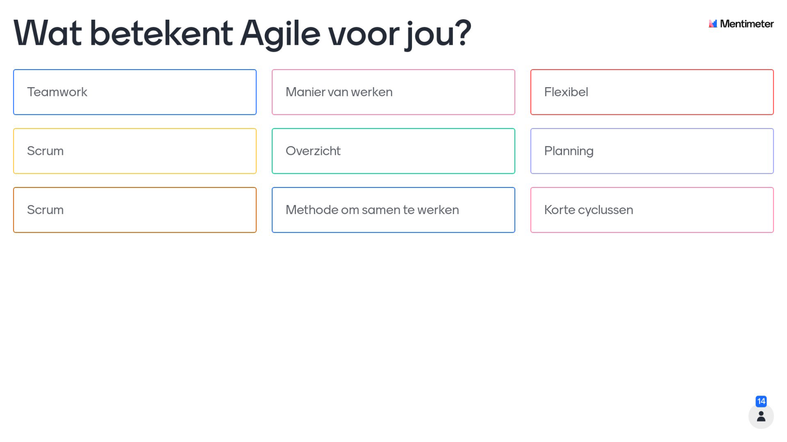
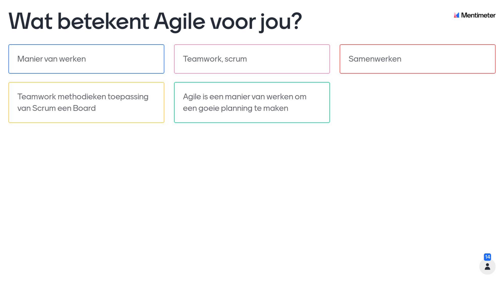
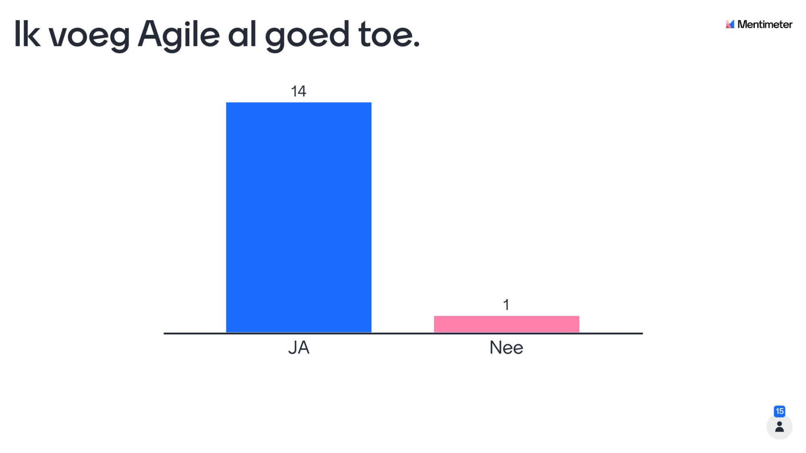

# Agile Methods

- [Agile Methods](#agile-methods)
  - [Inhoud](#inhoud)
  - [1. Wat is Agile en wat is Scrum?](#1-wat-is-agile-en-wat-is-scrum)
    - [Mentimeter](#mentimeter)
    - [2.1 Agile Manifesto](#21-agile-manifesto)
    - [2.2 Agile Principles](#22-agile-principles)
  - [5. Scrum](#5-scrum)
    - [5.1 Scrum Rollen](#51-scrum-rollen)
      - [5.1.1 Product Owner](#511-product-owner)
      - [5.1.2 Scrum Master](#512-scrum-master)
      - [5.1.3 Development Team](#513-development-team)
    - [5.2 Scrum Artefacten](#52-scrum-artefacten)
      - [5.2.1 Product Backlog](#521-product-backlog)
      - [5.2.2 Sprint Backlog](#522-sprint-backlog)
      - [5.2.3 Increment](#523-increment)
    - [5.3 Scrum Events](#53-scrum-events)
      - [5.3.1 Sprint Planning](#531-sprint-planning)
      - [5.3.2 Daily Scrum](#532-daily-scrum)
      - [5.3.3 Sprint Review](#533-sprint-review)
      - [5.3.4 Sprint Retrospective](#534-sprint-retrospective)
      - [5.3.5 Sprint](#535-sprint)
  - [6. Scrum Procces](#6-scrum-procces)
  - [7. Scrum vs. Waterfall](#7-scrum-vs-waterfall)
  - [8. Scrum vs. Kanban](#8-scrum-vs-kanban)
  - [9. Scrum vs. XP](#9-scrum-vs-xp)
  - [Kahoot](#kahoot)

## Inhoud

Deze pagina bevat een overzicht van wat agile is, wat scrum is, hoe scrum en agile werken en enkle verschillende agile methoden die er bestaan.

Doordat ik deze info heb opgedaan doormiddel van een zelfgemaakte workshop heb ik ook een heel aantal onderdelen van de workshop op deze pagina gezet.

In de workshop heb ik ook mentimeter en kahoot gebruikt om de kennis van de deelnemers te testen. Deze heb ik ook op deze pagina gezet.

## 1. Wat is Agile en wat is Scrum?

[Agile](https://www.agilealliance.org/agile101/) is een verzamelnaam voor een aantal methoden die zich kenmerken door een iteratieve en flexibele aanpak. Het is een manier van werken die zich kenmerkt door een aantal principes, waaronder:

- Mensen en interactie boven processen en tools
- Werkende software boven uitgebreide documentatie
- Samenwerking met de klant boven contractonderhandeling
- Reageren op verandering boven het volgen van een plan

Scrum is een van de Agile methoden. Scrum is een framework van agile.

### Mentimeter

Voordat we aan de workshop waren begonnen hadden we wat vragen opgesteld die we aan de leerling vroegen om te kijken wat ze denken over hun agile kennis.

Deze vragen hebben we gesteld met behulp van mentimeter. Hieronder zie je de resultaten van de vragen.

Hieruit hebben we kunnen halen dat vele toch al wel wisten wat agile was en de meeste ook al wel wisten wat scrum was. Dit was een goede start voor de workshop.

### 2.1 Agile Manifesto

Het Agile Manifesto is een document dat in 2001 is opgesteld door 17 mensen die de Agile Alliance oprichtten. Het manifesto is een verzameling van 4 principes die de basis vormen van Agile.

- Mensen en interactie boven processen en tools
- Werkende software boven uitgebreide documentatie
- Samenwerking met de klant boven contractonderhandeling
- Reageren op verandering boven het volgen van een plan

Dit is het allerbelangrijkste aan agile en eigenlijk een streven voor elke organisatie. Het is een soort richtlijn voor hoe je moet werken.

### 2.2 Agile Principles

Naast het manifesto zijn er ook nog een aantal principes die je moet volgen om agile te kunnen noemen. Deze principes zijn:

- Onze hoogste prioriteit is het tevreden stellen van de klant door het leveren van snel werkende software.
- Welkom veranderingen in de eisen, zelfs in de laatste fase van de ontwikkeling. Agile processen leveren frequent werkende software op, waarmee de klant zich kan aanpassen aan veranderende omstandigheden.
- Lever werkende software regelmatig, met een frequentie van weken tot maanden en een voorkeur voor korte cycli.
- Zorg ervoor dat de ontwikkelaars en de gebruikers samenwerken dagelijks gedurende het hele project.
- Bouw projecten rond gemotiveerde individuen. Geef ze de omgeving en de ondersteuning die ze nodig hebben, en vertrouw erop dat ze het werk zullen doen.
- Het gezicht van het team is belangrijker dan de gezichten van de individuele teamleden. Zorg ervoor dat het team een gezicht heeft dat de organisatie kan vertrouwen.
- De meest effectieve manier van communiceren met en binnen een team is het gezicht tot gezicht.
- Werkende software is de belangrijkste meetlat voor de voortgang.
- Agile processen bevorderen continue aandacht voor technische uitmuntendheid en goede ontwerp.
- Eenvoud, de kunst van het maximale resultaat met minimale inspanning, is essentieel.
- De beste architectuur, specificaties en ontwerpen ontstaan uit zelforganiserende teams.
- Op regelmatige basis, de ontwikkelteams reflecteren op hoe ze kunnen worden verbeterd en aanpassen hun werkwijze daaraan.

Deze lijst met principes is heel wat. De meeste hiervan zijn erg normaal en hebben de meeste geen moeite mee. Maar er zijn ook een aantal die wat moeilijker zijn. Zoals het laatste puntje, het reflecteren op hoe je kan verbeteren. Dit is iets wat je moet doen om agile te kunnen noemen. Het is dus belangrijk om dit te doen.

Dit is waar bijvoorbeel scrum kan helpen om dit te doen. Scrum is een framework van agile en helpt je om agile te kunnen noemen.

[Hier](https://www.agilealliance.org/agile101/12-principles-behind-the-agile-manifesto/) kan je meer lezen over de principes.

## 5. Scrum

Scrum zorgt ervoor dat je makkelijker agile kan werken. De manier waarop scrum dit doet noem je het scrum framework. Het scrum framework bestaat uit 3 rollen, 3 artefacten en 5 events.

### 5.1 Scrum Rollen

De 3 rollen in scrum zijn:

- [Product Owner (PO)](#511-product-owner)
- [Scrum Master (SM)](#512-scrum-master)
- [Development Team (DT)](#513-development-team)

#### 5.1.1 Product Owner

- Is de persoon die het product beheert.
- Is de persoon die de klant vertegenwoordigt.
- Is de persoon die de prioriteiten bepaalt.
- Is de persoon die de backlog beheert.

#### 5.1.2 Scrum Master

- Is de persoon die de scrum processen beheert.
- Is de persoon die het scrum team beheert.

#### 5.1.3 Development Team

- Zijn de personen die het product maken.
- Zijn de personen die de backlog uitvoeren.

### 5.2 Scrum Artefacten

De 3 artefacten in scrum zijn:

- [Product Backlog](#521-product-backlog)
- [Sprint Backlog](#522-sprint-backlog)
- [Increment](#523-increment)

#### 5.2.1 Product Backlog

De backlog zorgt ervoor dat het alle features en dingen die worden aangevragen door de klant bijhoudt. Dit is een lijst met alle features die de klant wil hebben. De product owner is degene die de backlog beheert. Hij kiest wat er nog gedaan moet worden en wat niet.

- Is een lijst van alle features die het product moet hebben.
- Is een lijst van alle features die het product kan hebben.
- Is een lijst van alle features die het product niet moet hebben.
- Is een lijst van alle features die het product niet kan hebben.

#### 5.2.2 Sprint Backlog

Is hetzelfde als de normale backlog alleen is deze maar voor 1 sprint van toepassing.

- Is een lijst van alle features die het product moet hebben in de komende sprint.
- Is een lijst van alle features die het product kan hebben in de komende sprint.

#### 5.2.3 Increment

Is een lijst van alle features die het product moet hebben in de komende sprint.

### 5.3 Scrum Events

De 5 events in scrum zijn:

- [Sprint Planning](#531-sprint-planning)
- [Daily Scrum](#532-daily-scrum)
- [Sprint Review](#533-sprint-review)
- [Sprint Retrospective](#534-sprint-retrospective)
- [Sprint](#535-sprint)

#### 5.3.1 Sprint Planning

De sprint planning is het moment waarop het team samenkomt om de backlog te bespreken en te kijken wat er in de komende sprint gedaan moet worden. Het team bespreekt welke features er in de komende sprint gedaan moeten worden en hoeveel tijd ze daarvoor nodig hebben. Het team bespreekt ook welke features er niet in de komende sprint gedaan moeten worden en waarom.

#### 5.3.2 Daily Scrum

De daily scrum is een dagelijkse meeting van 15 minuten waarin het team bespreekt wat ze gedaan hebben, wat ze gaan doen en wat ze tegenkomen. Het team bespreekt ook of ze nog hulp nodig hebben.

#### 5.3.3 Sprint Review

De sprint review is het moment waarop het team samenkomt om te bespreken wat er in de afgelopen sprint gedaan is. Dit is vaak in combinatie met de stakholder / opdrachtgever

#### 5.3.4 Sprint Retrospective

De sprint retrospective is het moment waarop het team samenkomt om te bespreken hoe ze de afgelopen sprint hebben gedaan. Het team bespreekt ook wat er goed ging en wat er beter kan.

#### 5.3.5 Sprint

De sprint is de periode waarin het team werkt aan de backlog. De sprint duurt meestal 3 weken maar staat niet vast.

## 6. Scrum Procces

In het scrum proces worden alle vooraf bepaalde rollen, artefacten en events gebruikt om het product te maken. Het scrum proces bestaat uit de 5 events zoals hierboven weergegeven.

Je begint dus met een idee. Door overleg met de stakholder en product owner ga je user stories opstellen. Hieruit volgt een product backlog. Iedere sprint wordt er gekeken welke user stories deze sprint van toepassing gaan zijn. Deze worden dan gedurende de sprint uitgewerkt. Na de sprint wordt er gekeken of de user stories zijn afgerond. Als dit niet het geval is wordt er gekeken wat er beter kan. Dit wordt dan weer meegenomen in de volgende sprint. Dit proces herhaalt zich dus steeds. Het is dus een iteratief proces.

## 7. Scrum vs. Waterfall

Scrum is een agile proces en waterfall is een traditioneel proces. Scrum is een iteratief proces en waterfall is een lineair proces. Scrum is een flexibel proces en waterfall is een rigide proces. Scrum is een adaptief proces en waterfall is een statisch proces. Scrum is een kwaliteitsgericht proces en waterfall is een kosten gericht proces. Scrum is een klantgericht proces en waterfall is een productgericht proces.

## 8. Scrum vs. Kanban

Scrum is een iteratief proces en kanban is een continu proces. Scrum is een adaptief proces en kanban is een statisch proces. Scrum is een kwaliteitsgericht proces en kanban is een kosten gericht proces. Scrum is een klantgericht proces en kanban is een productgericht proces.

Kanban en scrum lijken super veel op elkaar en dit is omdat het beide vormen van agile zijn. Dit maakt het dus super belangrijk voor een bedrijf om te weten wat het verschil is tussen de twee. Dit is namelijk de reden dat veel bedrijven scrum en kanban door elkaar gebruiken. Dit is echter niet de bedoeling. Het is namelijk zo dat scrum een iteratief proces is en kanban een continu proces is. Dit betekent dat scrum een proces is waarbij je steeds een stukje van het product afmaakt en kanban een proces is waarbij je het hele product afmaakt.

Kanban wordt vaak herkend aan de vele blaadjes en rommelige borden.

## 9. Scrum vs. XP

Scrum is een iteratief proces en XP is een iteratief proces. Scrum is een adaptief proces en XP is een adaptief proces. Scrum is een kwaliteitsgericht proces en XP is een kwaliteitsgericht proces. Scrum is een klantgericht proces en XP is een klantgericht proces. Scrum is een lineair proces en XP is een iteratief proces. Dit is ook het grote verschil. Het lijkt super veel op elkaar met het grote verschil dat je in scrum een product backlog hebt en in XP een product backlog en een release backlog. Dit is het grote verschil tussen de twee. Dit is omdat je bij scrum niet meer kan zeggen bij een sprint van nu doen we het anders terwijl dit bij xp iets meer de bedoeling is. Ook zijn het vaak wat kortere sprints.

## Kahoot

[kahoot](https://create.kahoot.it/details/1c0afbef-7c30-4e74-b7ea-91c19511dc39)
