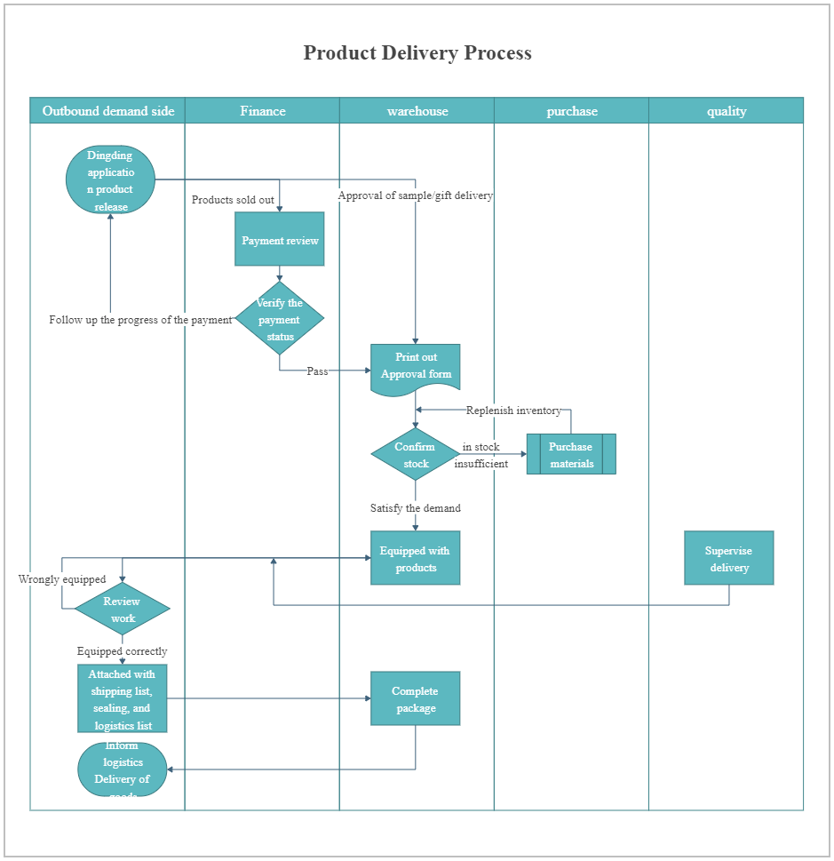
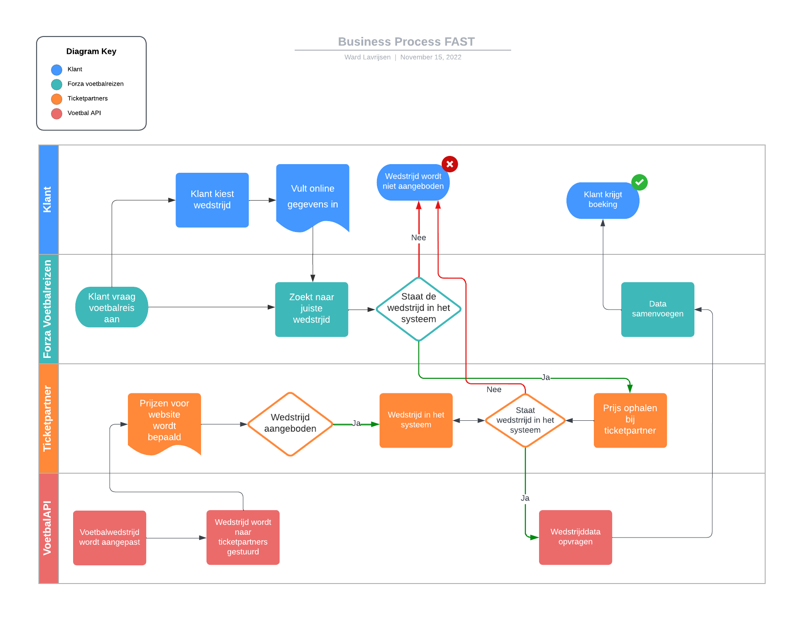
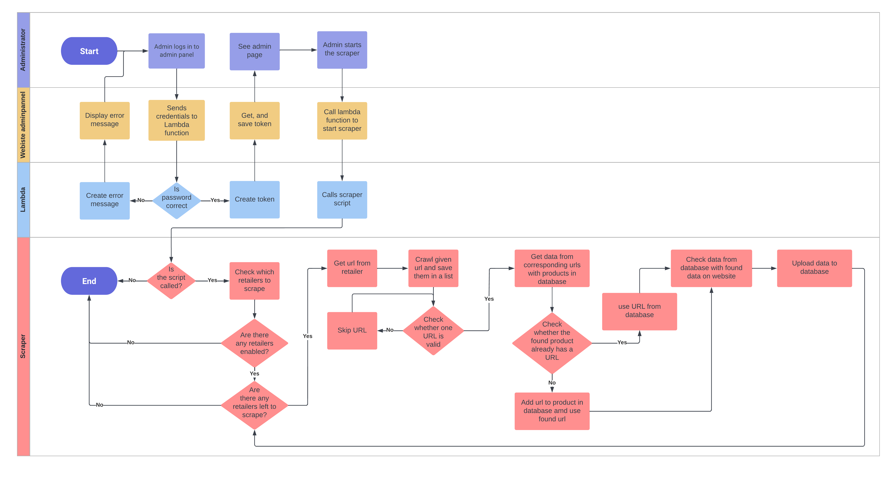
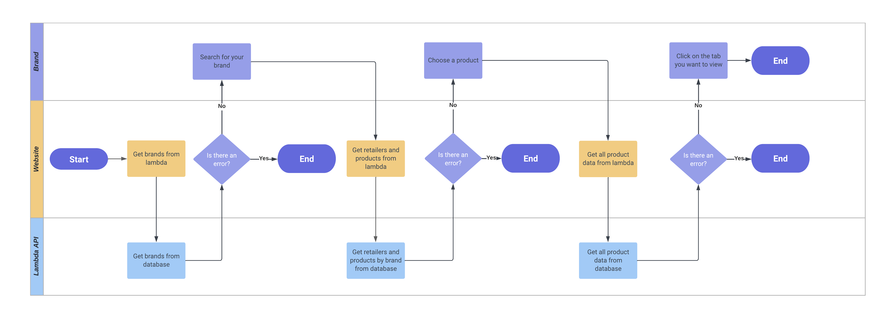

# Business Process

## Inhoudsopgave

- [Business Process](#business-process)
  - [Inhoudsopgave](#inhoudsopgave)
  - [1. Wat is een business proces?](#1-wat-is-een-business-proces)
    - [1.1. Operationele processen](#11-operationele-processen)
    - [1.2. Strategische processen](#12-strategische-processen)
    - [1.3. Management processen](#13-management-processen)
    - [1.4. Ondersteunende processen](#14-ondersteunende-processen)
    - [1.5 Voorbeelden van business processen](#15-voorbeelden-van-business-processen)
  - [2. Wat heeft een buisness proces te maken met Software Engineering?](#2-wat-heeft-een-buisness-proces-te-maken-met-software-engineering)
  - [3. wat is de cyclus van een business proces?](#3-wat-is-de-cyclus-van-een-business-proces)
    - [3.1 Design](#31-design)
    - [3.2 Model](#32-model)
    - [3.3 Execute](#33-execute)
    - [3.4 Monitor](#34-monitor)
    - [3.5 Optimize](#35-optimize)
  - [4. Mijn Business processen](#4-mijn-business-processen)
    - [4.1 individueel project](#41-individueel-project)
    - [4.2 Groepsopdracht](#42-groepsopdracht)

## 1. Wat is een business proces?

Een business process is een activiteit of een set actiteiten die uitgevoerd moeten worden om een bepaald doel te bereiken. Dit process moet een nuttig doel hebben en duidelijk worden geformuleerd. In bijna alle gevallen is dit in de vorm van een flowchart. Business processen komen in verschillende grootte business processen worden meestal opgesplitst in kleinere subprocessen die met elkaar verbonden zijn.

Verschillende soorten business processen zijn:

- [Business Process](#business-process)
  - [Inhoudsopgave](#inhoudsopgave)
  - [1. Wat is een business proces?](#1-wat-is-een-business-proces)
    - [1.1. Operationele processen](#11-operationele-processen)
    - [1.2. Strategische processen](#12-strategische-processen)
    - [1.3. Management processen](#13-management-processen)
    - [1.4. Ondersteunende processen](#14-ondersteunende-processen)
    - [1.5 Voorbeelden van business processen](#15-voorbeelden-van-business-processen)
  - [2. Wat heeft een buisness proces te maken met Software Engineering?](#2-wat-heeft-een-buisness-proces-te-maken-met-software-engineering)
  - [3. wat is de cyclus van een business proces?](#3-wat-is-de-cyclus-van-een-business-proces)
    - [3.1 Design](#31-design)
    - [3.2 Model](#32-model)
    - [3.3 Execute](#33-execute)
    - [3.4 Monitor](#34-monitor)
    - [3.5 Optimize](#35-optimize)
  - [4. Mijn Business processen](#4-mijn-business-processen)
    - [4.1 individueel project](#41-individueel-project)
    - [4.2 Groepsopdracht](#42-groepsopdracht)

### 1.1. Operationele processen

Operationele processen zijn de processen die direct verband houden met de productie van een product of dienst. Deze processen zijn vaak zeer complex en worden vaak opgesplitst in kleinere processen.

### 1.2. Strategische processen

Strategische processen zijn de processen die de organisatie helpen om haar doelen te bereiken.

### 1.3. Management processen

Management processen zijn de processen die de organisatie helpen om haar doelen te bereiken.

### 1.4. Ondersteunende processen

Ondersteunende processen zijn de processen die de organisatie helpen om haar doelen te bereiken.

### 1.5 Voorbeelden van business processen

Een voorbeeld van een business proces is het proces van het bestellen van een product. Dit proces begint met het zoeken naar een product op de website van de organisatie. Vervolgens wordt het product in het winkelmandje geplaatst en wordt er een betaalmethode gekozen. Als laatste wordt het product betaald en wordt het product verzonden.

Een ander voorbeeld van een business proces is het proces van het maken van een afspraak bij de tandarts. Dit proces begint met het zoeken naar een tandarts op de website van de organisatie. Vervolgens wordt er een afspraak gemaakt en wordt er een betaalmethode gekozen. Als laatste wordt de afspraak bevestigd en wordt de afspraak gemaakt.

Zo zie je dat er veel verschil zit in de business processen van verschillende organisaties. Dit komt omdat de business processen van een organisatie afhankelijk zijn van de doelstellingen van de organisatie.

Ook zie je een verschil in de groote en de complexiteit van de business processen.

## 2. Wat heeft een buisness proces te maken met Software Engineering?

Een business proces heeft te maken met software engineering omdat een business proces een activiteit of een set of actiteiten is die uitgevoerd moeten worden om een bepaald doel te bereiken. Dit doel kan zijn het maken van een website, het maken van een applicatie of het maken van een software systeem. Dit doel moet duidelijk worden geformuleerd en moet een nuttig doel hebben.

Een goed voorbeeld hierbij is het business proces van het release procces.

Maar je kunt het ook andersom zien. Zo heeft een buisness process ook software nodig. Dit is om een buisness proces een stuk efficienter en makkelijker te maken.

## 3. wat is de cyclus van een business proces?

De cyclus van een business proces is een cyclus die bestaat uit 5 stappen. Deze stappen zijn:

    1. Design
    2. Model
    3. Execute
    4. Monitor
    5. Optimize

### 3.1 Design

In de design fase wordt er een business proces ontworpen. In deze fase wordt er ook gekeken naar de doelstellingen van het business proces. Ook wordt er gekeken naar de doelgroep van het business proces. Dit wordt gedaan om te kijken of het business proces wel nuttig is voor de doelgroep.

### 3.2 Model

In de model fase wordt er een model gemaakt van het business proces. Het model wordt gemaakt door middel van een flowchart. In deze flowchart wordt er een duidelijk beeld gegeven van het business proces.

### 3.3 Execute

In de execute fase wordt het business proces uitgevoerd. In deze fase wordt er gekeken of het business proces goed werkt. Vaak door middel van geautomatiseerde tests.

### 3.4 Monitor

In de monitor fase wordt er gekeken of het business proces goed werkt. Dit door de KPI (Key Performance Indicator) te monitoren. De KPI is een maatstaf die aangeeft of het business proces goed werkt. Als de KPI niet goed is, dan wordt er gekeken waar het probleem zit en wordt er gekeken hoe het probleem opgelost kan worden.

### 3.5 Optimize

In de optimize fase wordt er gekeken hoe het business proces verbeterd kan worden. Dit wordt gedaan door middel van het analyseren van de KPI. Als de KPI niet goed is, dan wordt er gekeken waar het probleem zit en wordt er gekeken hoe het probleem opgelost kan worden.

## 4. Mijn Business processen

### 4.1 individueel project

Mijn business proces is het gebruiken van externe partijen om tickets op te halen en deze zo snel mogelijk aan klanten laten zien.

Het begint met een klant die een voetbalreis aanvraagd. Daarna wordt er gekeken of deze in het systeem staat. Als dit niet het geval is wordt er tegen de klant verteld dat de reis niet beschikbaar is of niet wordt aangeboden. Mocht de reis wel in het systeem staan wordt er gecomuniceerd met de externe ticketparner of zij deze tickets aanbieden en zo ja wat de prijs is. Mocht deze niet het gaval zijn moet de gebruiker worden ingeligd.

Daarnaast worden nieuwe wedstrijden of wijzigingen in wedstrijden vanuit een externe voetbal api met de ticketparner gecomuniceerd. In het geval dat de wedstrijd niet meer wordt aangeboden wordt de klant ingeligd.

Als alles goed is wordt deze data samengevoegd en wordt er een offerte aangemaakt. En deze wordt naar de klant gestuurd.

### 4.2 Groepsopdracht

Voor de groepsopdracht hebben we 2 proccessen gemaakt. 1 is het starten van de sraper en hoe deze werkt. En de andere naar het opvragen van productdata op de website.

_Het business proces van de scraper_

_Het business proces van de website_
