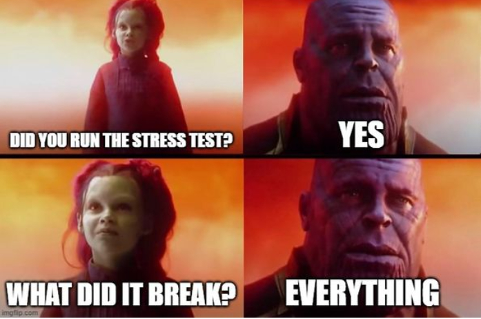

# Dot Framework Software Testen

## Inhoudsopgave

- [Dot Framework Software Testen](#dot-framework-software-testen)
  - [Inhoudsopgave](#inhoudsopgave)
  - [1. Inleiding](#1-inleiding)
  - [2. Hoofdvraag](#2-hoofdvraag)
  - [3. Deelvragen](#3-deelvragen)
  - [4. Wat is software testen?](#4-wat-is-software-testen)
    - [4.1 Funtional vs Non-functional testing](#41-funtional-vs-non-functional-testing)
  - [5. Welke verschillende software testen zijn er?](#5-welke-verschillende-software-testen-zijn-er)
    - [5.1 Unit tests](#51-unit-tests)
    - [5.2 Integration tests](#52-integration-tests)
    - [5.3 Regression Testing](#53-regression-testing)
    - [5.4 User Acceptance Testing](#54-user-acceptance-testing)
    - [5.5 End to end testing (e2e)](#55-end-to-end-testing-e2e)
    - [5.6 Performance Testing](#56-performance-testing)
    - [5.7 Load Testing](#57-load-testing)
      - [Waarom Load testen?](#waarom-load-testen)
    - [5.8 Security Testing](#58-security-testing)
    - [5.9 Usability Testing](#59-usability-testing)
    - [5.10 Compatibility Testing](#510-compatibility-testing)
    - [5.11 Stress tests](#511-stress-tests)
  - [6. Welke testen zijn handig voor mijn applicatie?](#6-welke-testen-zijn-handig-voor-mijn-applicatie)
  - [7. Conclusie](#7-conclusie)
  - [8. Bronnen](#8-bronnen)

## 1. Inleiding

Het testen van software is een proces dat wordt gebruikt om fouten, gaten of ontbrekende eisen in de sofware op te sporen. Het is een essentieel onderdeel van de levenscyclus van softwareontwikkeling, omdat het helpt waarborgen dat de software aan de beoogde kwaliteitsnormen voldoet en voor de gebruikers naar verwachting functioneert.

Bij het testen van software wordt de software uitgevoerd met de bedoeling gebreken te vinden en na te gaan of de software functioneert zoals bedoeld. Het doel van het testen van software is de kwaliteit en betrouwbaarheid van de software te verbeteren, en eventuele problemen op te sporen en te verhelpen voordat de software wordt vrijgegeven voor het publiek.

## 2. Hoofdvraag

Ik heb gekozen om mijn onderzoek te gaan doen over software testen. Ik heb gekozen voor dit onderwerp omdat ik het belangrijk vind om te weten hoe je software testen kan toepassen in je applicatie. Ik wilde weten welke soorten testen er zijn en hoe ik deze kan toepassen in mijn applicatie. Ik wilde ook weten welke testen handig zijn voor mijn applicatie.

Hieruit de volgende hoofdvraag:

> **Welke soorten testen zijn er en hoe kan ik deze in mijn applicatie gebruiken**

## 3. Deelvragen

- Hier de verschillende deelvragen:
- [Wat zijn software testen?](#4-wat-zijn-software-testen)
- [Welke verschillende software testen zijn er?](#5-welke-verschillende-software-testen-zijn-er)
- [Waar gebruik je welke testen?](#6-waar-gebruik-je-welke-testen)
- [Welke testen zijn handig voor mijn applicatie?](#7-welke-testen-zijn-handig-voor-mijn-applicatie)

## 4. Wat is software testen?

Het testen van software. Klink heel logisch maar is complexer en uitgebreider als je misschien denkt. Het is een proces waarbij een softwaretoepassing of -systeem wordt geëvalueerd om te bepalen of het voldoet aan de gespecificeerde eisen en werkt zoals bedoeld.

Testen is een belangrijke stap om ervoor te zorgen dat de software van hoge kwaliteit is en geschikt is voor het beoogde doel. Zonder goed testen kan softare gebreken of bugs vertonen waardoor het kan falen of zich onverwacht kan gedragen, wat kan leiden tot een reeks problemen. Van ongemak en frustratie voor de gebruiker tot ernstiger gevolgen zoals gegevensverlies.

Het doel van het testen van software is deze defecten en bugs op te sporen voordat de software aan de gebruikers wordt vrijgegeven. Dit kan worden gedaan met behulp van verschillende methoden en technieken, die elk hun eigen sterke en zwakke punten hebben.

Een van de belangrijkste voordelen van het testen van software is dat het helpt ervoor te zorgen dat de software betrouwbaar is en werkt zoals verwacht. Door de software in verschillende scenario's en onder verschillende omstandigheden te testen, is het mogelijk potentiële problemen en defecten op te sporen die tijdens het ontwikkelingsproces misschien niet voor de hand lagen. Dit kan helpen om het aantal defecten in de uiteindelijke versie van de software te verminderen, wat de gebruikerservaring kan verbeteren en de kans op falen kan verkleinen.

Softwaretesten kan ook helpen om de totale kosten van de ontwikkeling en het onderhoud van de software te verlagen. Door defecten vroeg in het ontwikkelingsproces op te sporen en te verhelpen, kan later duur en tijdrovend herwerk worden vermeden.

Samengevat, het testen van software is een kritische stap in het softwareontwikkelingsproces. Het helpt ervoor te zorgen dat de software betrouwbaar is, van hoge kwaliteit en geschikt voor het beoogde doel. Door defecten en bugs op te sporen en te verhelpen kan de gebruikerservaring worden verbeterd en kunnen de totale kosten van de ontwikkeling en het onderhoud van de software worden verlaagd.

### 4.1 Funtional vs Non-functional testing

Functioneel testen is een vorm van software testen die zich richt op het verifiëren van het juiste gedrag van een systeem volgens de specificaties. Bij deze vorm van testen wordt het systeem van input voorzien en wordt gecontroleerd of de output overeenkomt met de verwachte resultaten. Functioneel testen is meestal gebaseerd op de eisen en specificaties van het systeem, en het gaat erom hoe het systeem zich in verschillende scenario's moet gedragen.

Niet-functioneel testen daarentegen is een type softwaretest dat zich richt op de prestaties en betrouwbaarheid van een systeem. Dit type testen houdt zich bezig met de kwaliteitsattributen van het systeem, zoals de schaalbaarheid, betrouwbaarheid en bruikbaarheid. Niet-functioneel testen richt zich niet op het functionele gedrag van het systeem, maar op hoe goed het presteert in termen van deze kwaliteitsattributen.

## 5. Welke verschillende software testen zijn er?

Functionele testen:

1. Unit tests
2. Integration tests
3. Regression Testing
4. Acceptance Testing
5. End to end testing (e2e)

Non-functionele testen:

6. Performance Testing
7. Load Testing
8. Security Testing
9. Usability Testing
10. Compatibility Testing
11. Stress Test

### 5.1 Unit tests

Unit tests zijn meestal klein en gericht, en ontworpen om een specifiek deel van de code te testen. Ze worden vaak geschreven door de ontwikkelaars die de code hebben geschreven, en worden meestal automatisch uitgevoerd als onderdeel van het ontwikkelingsproces.

Een van de belangrijkste voordelen van unit testing is dat het helpt om defecten en bugs vroeg in het ontwikkelingsproces op te sporen. Door de afzonderlijke eenheden van de code te testen, is het mogelijk problemen te identificeren en op te lossen voordat ze ernstiger worden en moeilijker op te lossen zijn.

Een ander voordeel van unit testing is dat het de kwaliteit van de code helpt verbeteren. Door de afzonderlijke eenheden van de code te testen, kan ervoor worden gezorgd dat ze correct zijn en werken zoals bedoeld. Dit kan helpen om de betrouwbaarheid en de prestaties van de software te verbeteren, wat kan leiden tot een betere gebruikerservaring.

### 5.2 Integration tests

Integratie testen wordt gedefinieerd als een soort testen waarbij software modules logisch worden geïntegreerd en als groep worden getest. Een typisch softwareproject bestaat uit meerdere softwaremodules. Het doel van deze test is het blootleggen van gebreken in de interactie tussen deze softwaremodules wanneer zij worden geïntegreerd.

Integratietesten zijn nodig omdat het gedrag van een systeem kan veranderen als de componenten worden gecombineerd. Twee componenten die afzonderlijk perfect werken, werken bijvoorbeeld niet zoals verwacht samen. Integratietesten helpen dergelijke problemen op te sporen voordat het systeem wordt vrijgegeven aan de gebruikers.

Er zijn verschillende benaderingen van integratietesten, waaronder top-down, bottom-up en big bang. Bij top-down testen wordt het systeem van het hoogste tot het laagste niveau getest, waarbij de componenten op een lager niveau worden gesimuleerd. Bij bottom-up testen wordt de omgekeerde benadering gevolgd, waarbij wordt begonnen met de componenten op het laagste niveau en wordt opgewerkt naar het hoogste niveau. Bij big bang testing worden alle componenten in één keer geïntegreerd en samen getest.

### 5.3 Regression Testing

Regressietesten worden gedefinieerd als een soort softwaretesten om te bevestigen dat een recente codewijziging de bestaande functies niet heeft aangetast. Regressietests zijn niets anders dan een volledige of gedeeltelijke selectie van reeds uitgevoerde testgevallen die opnieuw worden uitgevoerd om ervoor te zorgen dat de bestaande functionaliteiten goed werken.

Regressietesten zijn nodig wanneer de code wordt gewijzigd, en je moet bepalen of de gewijzigde code andere delen van de softwareapplicatie zal beïnvloeden. Bovendien zijn regressietesten nodig wanneer een nieuwe functie aan de softwareapplicatie wordt toegevoegd.

### 5.4 User Acceptance Testing

User Acceptance Testing (UAT) is een type test dat door de eindgebruiker of de klant wordt uitgevoerd om het softwaresysteem te verifiëren voordat de softwareapplicatie naar de productieomgeving wordt verplaatst. UAT vindt plaats in de laatste fase van het testen.

Het belangrijkste doel van UAT is het valideren van de end-to-end business flow. Het richt zich niet op cosmetische fouten, spelfouten of systeemtests. User Acceptance Testing wordt uitgevoerd in een aparte testomgeving met een productie-achtige gegevensopstelling. Het is een soort black box testing waarbij twee of meer eindgebruikers betrokken zijn.

Deze testen worden daarom ook door de eindgebruiker of de klant gedaan.

User Acceptance Testing zijn nodig zodra de software eenheids-, integratie- en systeemtests heeft ondergaan, omdat ontwikkelaars mogelijk software hebben gebouwd op basis van een document met eisen op basis van hun eigen inzicht en verdere vereiste wijzigingen tijdens de ontwikkeling mogelijk niet effectief aan hen zijn meegedeeld, dus om te testen of het eindproduct door de klant/eindgebruiker wordt aanvaard, zijn gebruikersacceptatietests nodig.

### 5.5 End to end testing (e2e)

End-to-end testen is een soort softwaretesten waarbij de functionaliteit van een systeem wordt geverifieerd door scenario's uit de praktijk te simuleren. Bij deze vorm van testen wordt het hele systeem van begin tot eind getest om er zeker van te zijn dat alle onderdelen werken zoals bedoeld.

Het doel van end-to-end testen is het testen van hele software op afhankelijkheden, gegevensintegriteit en communicatie met andere systemen, interfaces en databases om een volledig productie-achtig scenario uit te oefenen.

End-to-end testen is belangrijk omdat het helpt verzekeren dat het systeem geschikt is voor gebruik en voldoet aan de behoeften van de gebruikers. Door scenario's uit de praktijk te simuleren, helpen end-to-end tests eventuele problemen te identificeren die zich kunnen voordoen wanneer het systeem in de praktijk wordt gebruikt. Dit kunnen problemen zijn met de gegevensstroom, de afhandeling van fouten en de prestaties.

Al met al is end-to-end testen een belangrijke stap in het softwareontwikkelingsproces. Het helpt ervoor te zorgen dat een systeem geschikt is voor gebruik en voldoet aan de behoeften van de gebruikers. Door end-to-end testen uit te voeren, kunnen ontwikkelaars betrouwbaardere en effectievere systemen bouwen die een goede gebruikerservaring bieden.

### 5.6 Performance Testing

Performance Testing wordt gebruikt om de snelheid, responstijd, stabiliteit, betrouwbaarheid, schaalbaarheid en het gebruik van middelen van een softwareapplicatie onder een bepaalde workload te testen. Het belangrijkste doel van prestatietesten is het identificeren en elimineren van de prestatieproblemen in de softwareapplicatie.

De focus van Performance Testing is het controleren van een software programma's

- Snelheid - bepaalt of de toepassing snel reageert
- Schaalbaarheid - Bepaalt de maximale gebruikersbelasting die de softwaretoepassing aankan.
- Stabiliteit - Bepaalt of de toepassing stabiel is bij wisselende belasting.

Waarom Performance testen?

Functies en functionaliteit die door een software systeem worden ondersteund zijn niet de enige zorg. De prestaties van een software applicatie, zoals reactietijd, betrouwbaarheid, gebruik van middelen en schaalbaarheid, zijn wel degelijk van belang. Het doel van Performance Testing is niet het vinden van bugs, maar het elimineren van performance knelpunten.

Performance Testing wordt gedaan om belanghebbenden te voorzien van informatie over hun applicatie met betrekking tot snelheid, stabiliteit en schaalbaarheid. Belangrijker nog, Performance Testing brengt aan het licht wat verbeterd moet worden voordat het product op de markt komt. Zonder Performance Testing is de kans groot dat de software lijdt aan problemen zoals: traag draaien terwijl meerdere gebruikers tegelijkertijd gebruik maken van de software, inconsistenties op verschillende besturingssystemen en slechte bruikbaarheid.

Performance tests kunnen in verschillende stadia van het ontwikkelingsproces worden toegevoegd, afhankelijk van de specifieke eisen en doelstellingen van het project. Prestatietests kunnen bijvoorbeeld tijdens de ontwerpfase worden toegevoegd om potentiële prestatieknelpunten op te sporen en het ontwerp van het systeem te sturen. Ze kunnen ook worden toegevoegd tijdens de implementatiefase om ervoor te zorgen dat het systeem aan de prestatie-eisen voldoet.

In het algemeen moeten prestatietests zo vroeg mogelijk in het ontwikkelingsproces worden toegevoegd, zodat potentiële prestatieproblemen kunnen worden opgespoord en aangepakt voordat het systeem aan de gebruikers wordt vrijgegeven. Dit kan ertoe bijdragen dat het systeem geschikt is voor gebruik en voldoet aan de behoeften van de gebruikers.

### 5.7 Load Testing

Load Testing is een softwaretestproces waarbij de prestaties van een softwareapplicatie worden getest onder een specifieke verwachte belasting. Het bepaalt hoe de softwareapplicatie zich gedraagt wanneer deze door meerdere gebruikers tegelijk wordt benaderd. Het doel van Load Testing is knelpunten in de prestaties te verbeteren en de stabiliteit en goede werking van de softwareapplicatie te waarborgen voordat deze wordt ingezet.

#### Waarom Load testen?

- Vertrouwen geven in het systeem en de betrouwbaarheid en prestaties ervan.
- Knelpunten in het systeem identificeren onder zware gebruikersstressscenario's voordat deze zich voordoen in een productieomgeving.
- Een uitstekende bescherming tegen slechte prestaties en biedt aanvullende strategieën voor performance management en monitoring van een productieomgeving.

### 5.8 Security Testing

Security testing is het testen van een computersysteem, netwerk of webapplicatie om kwetsbaarheden op te sporen die een aanvaller zou kunnen uitbuiten. Deze kwetsbaarheden kunnen vele vormen aannemen, zoals zwakke wachtwoorden, ongepatchte software of onbeschermde poorten.

Het uitvoeren van beveiligingstests is essentieel om de vertrouwelijkheid, integriteit en beschikbaarheid van een systeem te waarborgen. Vertrouwelijkheid verwijst naar de bescherming van gevoelige gegevens, zoals financiële informatie of persoonlijke dossiers, tegen ongeoorloofde toegang. Integriteit heeft betrekking op de nauwkeurigheid en volledigheid van gegevens, en zorgt ervoor dat er niet mee geknoeid of geknoeid is.

Een van de belangrijkste uitdagingen van beveiligingstests is dat ze regelmatig moeten worden uitgevoerd om effectief te blijven. Dit komt doordat er voortdurend nieuwe kwetsbaarheden worden ontdekt en aanvallers voortdurend nieuwe methoden ontwikkelen om deze te misbruiken. Daarom moeten beveiligingstests een continu proces zijn om ervoor te zorgen dat een systeem veilig blijft.

Naast de technische aspecten van beveiligingstests zijn er ook belangrijke menselijke factoren waarmee rekening moet worden gehouden. Zo kunnen de opleiding en het bewustzijn van gebruikers een cruciale rol spelen bij de beveiliging van een systeem. Door gebruikers voor te lichten over veilige wachtwoordpraktijken, het belang van het up-to-date houden van software en de mogelijke gevolgen van een cyberaanval, kan de kans op een succesvolle aanval worden verkleind.

### 5.9 Usability Testing

Usability testen, ook bekend als User Experience (UX) Testing, is een testmethode om te meten hoe gemakkelijk en gebruiksvriendelijk een softwareapplicatie is. Een kleine groep eindgebruikers gebruikt de software om gebreken in de bruikbaarheid aan het licht te brengen. Bij het testen van de bruikbaarheid wordt vooral gekeken naar het gebruiksgemak van de applicatie, de flexibiliteit van de applicatie en de mate waarin de applicatie aan de doelstellingen voldoet.

### 5.10 Compatibility Testing

Compatibiliteitstests zijn een soort softwaretests die worden gebruikt om ervoor te zorgen dat een bepaald stuk software compatibel is met verschillende hardware, software, besturingssystemen en netwerkomgevingen. Deze vorm van testen is belangrijk omdat software vaak in verschillende omgevingen wordt gebruikt, en het is essentieel dat de software in al deze omgevingen correct functioneert.

Om deze uitdaging aan te gaan, worden bij compatibiliteitstests vaak automatiseringstools gebruikt die kunnen helpen om een stuk software snel en efficiënt te testen in een groot aantal omgevingen. Deze tools kunnen worden geconfigureerd om dezelfde tests op meerdere omgevingen uit te voeren, wat tijd en moeite bespaart. Daarnaast kunnen compatibiliteitstests ook handmatige tests omvatten, waarbij menselijke testers de software handmatig in verschillende omgevingen uitvoeren en controleren op eventuele problemen of bugs.

### 5.11 Stress tests

Stress Testing is een vorm van software testen die de stabiliteit en betrouwbaarheid van software applicaties verifieert. Het doel van stress testen is het meten van software op zijn robuustheid en foutafhandeling onder extreem zware belasting en ervoor zorgen dat software niet crasht. Het test zelfs verder dan de normale werkpunten en evalueert hoe software werkt onder extreme omstandigheden.

Hier heb je goede voorbeelden voor wanneer stress testen nodig is:

- Tijdens festivals kan een online winkelsite een piek in het verkeer meemaken, of wanneer een verkoop wordt aangekondigd.
- Wanneer een blog wordt vermeld in een toonaangevende krant, ervaart het een plotselinge piek in het verkeer.

Het is absoluut noodzakelijk om stresstests uit te voeren om dergelijke abnormale verkeerspieken op te vangen. Als dit plotselinge verkeer niet wordt opgevangen, kan dit leiden tot inkomsten- en reputatieverlies.

Stress testen is ook uiterst waardevol om de volgende redenen:

- Controleren of het systeem werkt onder abnormale omstandigheden.
- Het tonen van de juiste foutmelding wanneer het systeem onder stress staat.
- Systeemfalen onder extreme omstandigheden kan resulteren in een enorm inkomstenverlies.
- Het is beter om voorbereid te zijn op extreme omstandigheden door Stress Testing uit te voeren.

## 6. Welke testen zijn handig voor mijn applicatie?

Ik heb een applicatie waain je competities kan opvragen, hierbij clubs kan opslaan, wedstrijden kan bekijken en hierbij de verschillende prijzen.

De verschillende testen die handig zijn om toe te voegen aan mijn applicatie zijn.

- Unit testen
- Integration testen
- End-to-end testen
- Performance Testing
- Usability Testing
- Compatibility Testing
- Stress testing

Hoe ik deze heb geinplementeerd lees je [hier]("../../../FAST/SoftwareQualityInsurence.md")

## 7. Conclusie

> **Welke soorten testen zijn er en hoe kan ik deze in mijn applicatie gebruiken**

Het testen van software is een cruciale stap in het ontwikkelingsproces van elk softwareproduct. Het helpt ervoor te zorgen dat het product van hoge kwaliteit is en vrij van gebreken, waardoor het betrouwbaarder en gebruiksvriendelijker wordt. Door het product grondig te testen voordat het wordt vrijgegeven, kunnen ontwikkelaars eventuele problemen opsporen en oplossen, wat resulteert in een betere algemene ervaring voor gebruikers.

Daarnaast ga ik meerdere soorten testen toevoegen zodat mijn applicatie beschermt is tegen verschillende soorten bugs.

## 8. Bronnen

- [Canvas Software Testen](https://fhict.instructure.com/courses/12517/pages/testing-what-when-and-where?module_item_id=835976)
- [Wikipedia Software Testen](https://en.wikipedia.org/wiki/Software_testing)
- [Applause Testing types](https://www.applause.com/blog/functional-testing-types-examples)
- [Geeks for Geeks types of software testing](https://www.geeksforgeeks.org/types-software-testing/)
- [Testen (software)](<https://nl.wikipedia.org/wiki/Testen_(software)>)
- [guru sofware testing](https://www.guru99.com/software-testing.html)
- [guru unit testing](https://www.guru99.com/unit-testing-guide.html)
- [guru stress testing](https://www.guru99.com/stress-testing-tutorial.html)
- [guru integration testing](https://www.guru99.com/integration-testing.html)
- [guru Regression testing](https://www.guru99.com/regression-testing.html)
- [guru User Acceptance Testing testing](https://www.guru99.com/user-acceptance-testing.html)
- [guru User Acceptance Testing testing](https://www.guru99.com/end-to-end-testing.html)
- [circleCI e2e](https://circleci.com/blog/what-is-end-to-end-testing/)
- [guru Load testing](https://www.guru99.com/load-testing.html)
- [guru performance testing](https://www.guru99.com/performance-testing.html)
- [guru compatibility testing](https://www.guru99.com/compatibility-testing.html)
