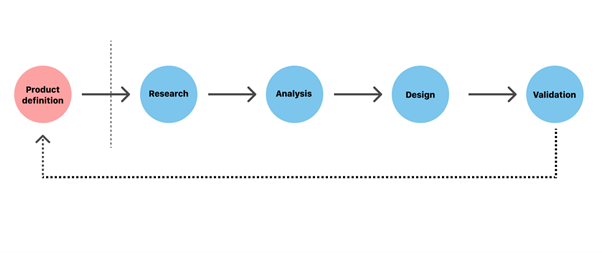
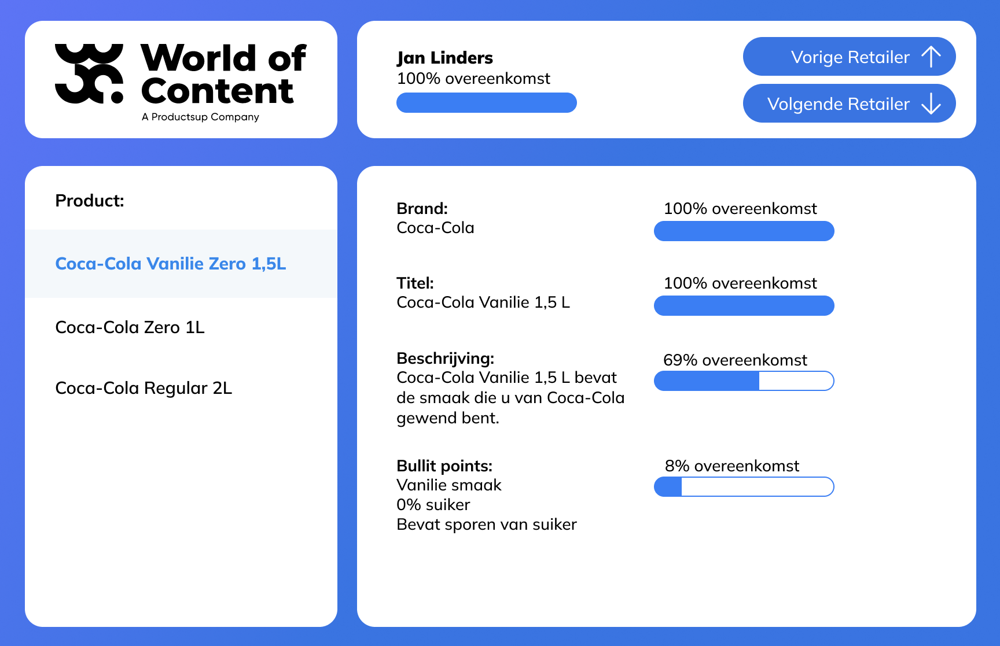

# World Of Content UX

[bron](https://xd.adobe.com/ideas/guides/ux-design-process-steps/)

## Inhoudsopgave

- [World Of Content UX](#world-of-content-ux)
  - [Inhoudsopgave](#inhoudsopgave)
  - [Hoe gaat het UX-proces te werk?](#hoe-gaat-het-ux-proces-te-werk)
  - [Product definition](#product-definition)
    - [Wie zijn World of Content (WoC)](#wie-zijn-world-of-content-woc)
    - [Wat is de opdracht voor World of Content (WoC)](#wat-is-de-opdracht-voor-world-of-content-woc)
  - [Research](#research)
    - [User survey](#user-survey)
    - [Interview Stakeholder](#interview-stakeholder)
  - [Analyse](#analyse)
    - [Userstory’s](#userstorys)
    - [Interview](#interview)
  - [Design](#design)
    - [Ideen](#ideen)
    - [Designs](#designs)
      - [Design 1](#design-1)
      - [Design 2](#design-2)
      - [Design 3](#design-3)
      - [Design 4](#design-4)
      - [Design 5](#design-5)
      - [Design 6](#design-6)
    - [Het gekozen design](#het-gekozen-design)
  - [Verdere veranderingen](#verdere-veranderingen)
    - [Adminpagina](#adminpagina)
    - [Feedback van de designers van World of Content](#feedback-van-de-designers-van-world-of-content)
  - [Development](#development)
  - [Reflectie](#reflectie)

## Hoe gaat het UX-proces te werk?

De 5 stappen van UX zijn:

- Product definition
- Research
- Analysis
- Design
- Validation

## Product definition

Wat superbelangrijk is bij het maken van het product is het product begrijpen. Voor wie is het? Waarom bestaat het? Wie zijn de gebruikers? Wat is de belangrijkste informatie voor de gebruiker? Dit wordt vaak door het team in samenwerking met de stakeholders besproken.

### Wie zijn World of Content (WoC)

World of Content levert aan zijn klanten een platform voor content delivery. zij zorgen ervoor dat jou content op alle platform klopt. Denk hierbij aan Coca-Cola. Zij hebben erg veel verschillende producten en willen dat deze bij al hun retailers overeenkomt. Hier komt World of content aan te pas. WoC zorgt ervoor dat een brand hun content op hun platform kan beheren en uitsturen naar alle verschillende retailers.

### Wat is de opdracht voor World of Content (WoC)

Voor de klanten van WoC is het moeilijk om een live score te zien. Dit betekent een score van hoeveel content er juist op de site staat. Komt de titel overeen? De beschrijving? De afbeelding? Etc. Daarom gaan we een platform maken die ervoor zorgt dat alle brands bij verschillende retailers kunnen zien of de data overeenkomt. Daarom ga ik in dit document de UX doen om ervoor te zorgen dat deze data in een gebruikersvriendelijke interface komt.

## Research

Een belangrijk onderdeel is research. Dit is het onderzoeken van wensen van klanten.

### User survey

De user survey zijn afgenomen bij mede studenten aangezien we geen contact hebben met toekomstige gebruikers. Dit zijn de gestelde vragen en de antwoorden van de gebruikers:

---

**Wat wil je bereiken met dit product?**

**Antwoorden:**

- de data die wij van merken krijgen checken of deze data daadwerkelijk ook klopt op de website van een supermarktketen.
- Ik wil graag te weten komen of de data die ik lever aan bijvoorbeeld de Jumbo of Albertheijn ook op hun websites staat zodat ik hen kan informeren, wanneer dit niet zo is, dat dit moet worden geüpdated.
- Zodat ik kan zien of mijn teksten online staan op de retailers site.
- Ik wil achterhalen of retailers die mijn product verkopen ook de juiste content op hun website hebben geplaatst.

---

**Wat zijn de hindernissen die je zonder dit product tegenkomt?**

**Antwoorden:**

- De aangeleverde data is zo langzaam, of zelfs niet te controleren.
- Ik moet anders alle pagina's handmatig één voor één opzoeken en vergelijken.
- Dat het niet duidelijk is of mijn content online staat bij retailers.
- Retailers kunnen nog outdated content op hun website hebben wat voor de klant niet goed is.

---

**Heb je verder nog ideeën voor dit product?**

**Antwoorden:**

- beetje moderne uitstraling waar overzichtelijk te zien is bijvoorbeeld hoeveel procent van de data van het product klopt
- Dat de website duidelijk en overzichtelijk is. Ik wil overal in een oogopslag kunnen zien waar ik ben en wat ik kan doen.
- Ja dat ik de retailers makkelijk kan mailen met wat er dan nog niet online staat.
- Nee

---

**Waar wil je snel een overzicht van kunnen zien?**

**Antwoorden:**

- het percentage per product wat klopt. misschien ook wat er niet en wel klopt.
- Of de gegevens van mijn producten over het algemeen goed op de website staat.
- Wat er allemaal online staat op de website van de retailers.
- Product met score.

---

**Hoe nuttig is het product voor jou?**

**Antwoorden:**

- het kan veel communicatie tussen merken en supermarktketens verbeteren wat nu weken, maanden of zelfs langer kan duren. zo wordt de data tijdig aangepast zodat wat er wordt aangeleverd weer klopt op de website.
- Heel nuttig, dit helpt mij om mijn gegevens correct op de websites te hebben staan.
- Heel nuttig zo kan ik makkelijk en snel zien of mijn content ook echt geplaatst is.
- Heel nuttig, aangezien ik zo achter retailers aan kan gaan.

---

### Interview Stakeholder

Ook is het natuurlijk van belang om te weten wat de stakeholder wil. Daarvoor zijn deze vragen opgesteld.

**Vragen:**

1. Wat is het probleem jullie proberen op te lossen?
2. Wat moet het product doen?
3. Wie zijn de gebruikers van dit product?
4. Zijn er al stijleisen waaraan voldaan moet worden?
5. Waarom is dit product voor de gebruikers?
6. Wat hebben jullie al geprobeerd wat niet werkte?
   a. Waarom werkte dit niet?
7. Wat weet je zeker van de gebruikers?
8. Wat is het allerbelangrijkste voor de gebruiker om uit het product wil halen?

**Antwoorden:**

1. Content checken of die daadwerkelijk op de retailer website staat zoals het door de brand is gegeven.
2. Content checken zoals gegeven in de Excel bestanden en daarna score berekenen en op de website laten zien per product per retailer voor elke brand.
3. Brands die content score gaan bespreken met de retailer.
4. Nee dit is vrij aan de developers om te maken
5. Zodat zij een makkelijk overzicht hebben van elke score en dit kunnen bespreken met de retailers
6. Ze hebben gekeken naar het attribute value systeem.
7. Dat zij een brand zijn
8. De score per product per onderdeel binnen het product

## Analyse

Nadat er onderzoek is gedaan kun je te werk gaan met het opstellen van een analyse. Dit is door alle vragen en antwoorden te verwerken in de analyse.

### Userstory’s

Door het interview met de stakeholder zijn er userstory’s opgesteld. Deze zijn hieronder te zien.

- Als gebruiker wil ik verschillende retailers zien die bij de brand horen die ik heb aangeklikt, zodat ik naar die retailer kan gaan.
- Als gebruiker wil ik verschillende brands op de landing page zien, zodat ik mijn brand kan kiezen.
- Als gebruiker wil ik verschillende producten zien die bij de retailer beschikbaar zijn van de brand die eerder is gekozen, zodat ik de totale score kan zien.
- Als gebruiker wil ik een specifiek product zien van een brand die bij de retailer beschikbaar is, zodat ik specifiekere data over de live score kan zien.
- Als gebruiker wil ik kunnen zien of de gegeven data overeenkomt met de retailer website doormiddel van een livescore, zodat ik een duidelijk overzicht heb.

Overige dingen die we hebben geleerd:

- Een overzicht met alle brands. Deze kun je doorklikken voor een overzicht van alle retailers daarna kun je door naar de verschillende producten en dan kun je nog doorklikken naar een eigen product.
- Een inlogpagina is overbodig.
- Het moet voor de gebruiker snel en makkelijk te zien zijn.

### Interview

Na de userstorys hebben we nog even een interview gedaan met de stakeholder om alle kleine andere vragen duidelijk te maken.

**Vragen:**

1. Wat willen jullie zien op de productpagina?
2. Willen jullie dat de websitedata wordt opgeslagen?
3. Maakt het iets uit als de titel in de beschrijving staat? Is het dan nog steeds 100%.
4. Hoe moeten de scores nou komen te staan brand, beschrijving en titel of bullet points er nog bij en dan individueel elk stukje tekst de score? (Dit wordt denk ik wel in de berekening gedaan voor totale scores)
5. Moet je een brand kunnen toevoegen? Moet je een retailer kunnen toevoegen?
6. Moeten we per kolom (Zoals Excel) een score maken of volgens vaste eigenschappen?

**Antwoorden:**

1. Veel data laten zien is goed. Wel is het belangrijk om duidelijk te laten zien. Het is namelijk belangrijk dat de gebruiker goed kan zien wat het verschil is tussen de live en niet live variant.
2. Hoort bij het antwoord van hierboven.
3. Kijken per element of de data klopt. Dus bijvoorbeeld met titel of header tag.
4. Per individueel element is het een ja nee score. Het totale product kan dan een score in percentages hebben.
5. Moet eventueel later toegevoegd kunnen worden.
6. De verschillende elementen moeten dynamisch zijn. Dus voor iedere retailer kan dit anders zijn.

Door de antwoorden van de stakeholder zijn er nog wat dingen veranderd. Zoals de userstorys en de analyse.

## Design

### Ideen

Doordat World of Content een al bestaand bedrijf is hebben we proberen te kijken naar de huidige website. Kijken naar hun stijl en hoe ze het hebben gedaan. Dit is wat we op hun website tegen kwamen wat ons wel aansprak.

vanuit dit design hebben we een aantal ideen opgesteld. Deze zijn hieronder te zien.

### Designs

[Hier zijn alle designs te zien en de verschillende iteraties die we hebben gemaakt in Figma.](https://www.figma.com/file/QXiSsczGjRt8JTmbToN7Wz/World-Of-Content-Live-Score?node-id=0%3A1)

#### Design 1

#### Design 2

#### Design 3

#### Design 4

#### Design 5

#### Design 6

Uiteindelijk is er besloten om verder te gaan met design 2 (lijkt op design 6) en hier op voort te bouwen. Dit is omdat dit design het meest overeenkomt met de huidige website van World of Content. Dit is ook het design dat het meest overzichtelijk is.

Gezien de info die we uit de userstorys hebben gekregen en de verschillende intervieuws hebben we nog wat aanpassingen gedaan op dit design en is dit wat daar uit is gekomen.

### Het gekozen design

## Verdere veranderingen

Natuurlijk hoort bij UX ook het veranderen van de designs naar de nieuwe requirements. Dit is natuurlijk heel vaak gebeurt. Denk bij deze veranderen aan kleine dingetjes:

- Border Radius bij alle verschillende elemeten erbij zetten.
- Knoppen andere kleuren geven dat ze wat meer opvallen. Denk hierbij aan de knoppen die je kan gebruiken om de data te filteren.
- Alle tekst engels maken.
- pagination weghalen bij 1 pagina

Maar ook een hebben we een aantal hele grote dingen aangepast. Denk hierbij aan:

- Een gehele adminpagina
- De productpagina aanpassen zodat er meerdere grafieken zijn.

### Adminpagina

De admin pagina moet uit verschillende onderdelen bestaan. Zo moet er een pagina zijn waar je de brands kan zien en aanpassen, De retailers kunnen zien en aanpassen, de informatie van de scraper kunnen zien en de verschillende instellingen kunnen aanpassen. Deze paginas zijn hieronder te zien.

### Feedback van de designers van World of Content

Na het maken van de designs zijn deze naar de designers van world of content gestuurd. Zij hebben feedback gegeven op de designs. Deze feedback is hieronder te zien.

[Figma](https://www.figma.com/file/QXiSsczGjRt8JTmbToN7Wz/World-Of-Content-Live-Score?node-id=0%3A1)

Na het ontvangen van de feedback hebben we de designs aangepast en hebben we een nieuwe versie gemaakt. Deze is hieronder te zien.

## Development

De development is gedaan in Next.js. Dit is een framework die we al kenden en waar we ook al ervaring mee hadden. Dit is ook een framework die we in de toekomst nog wel eens zouden kunnen gebruiken. Daarnaast is het ook een framework die we goed kunnen gebruiken voor het maken van een prototype.

## Reflectie

Ux is een onderdeel waar ik super veel tijd aan heb besteed. Ik heb echt wel heel veel geleerd door dit te doen. Ook heb ik samengewerkt met de designers van world of content. Hierdoor heb ik veel geleerd over het maken van designs en hoe je dit het beste kan doen. Ik hoop dat ik dit in de toekomst nog veel kan gebruiken.

Er zijn natuurlijk nog dingen die verbeterd kunnen worden. Zo zou op de adminpagina het settings blokje weg kunnen op het moment dat je bij bijvoorbeeld brands bent. Het leuke aan UI/UX is ook dat het constant verandert op dezelfde manier als je code veranderd. Dit zorgt voor meerdere iteraties en dat je een goede connectie met je bedrijf kan maken.
